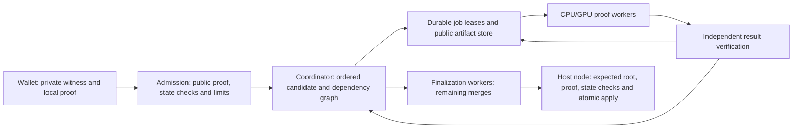

# Distributed proving and throughput roadmap

> **PROPOSED / NOT IMPLEMENTED — 2026-10-01.** This specifies a public-only
> distributed proving service for Lattica. It does not activate block-v2,
> change consensus, or establish a measured transactions-per-minute capability.
> [Block-proving v2](block-proving-v2.md) controls the existing candidate profile
> and release gates; [SPEC.md](../SPEC.md) controls protocol requirements.

The companion [throughput engineering plan](high-throughput-proving-plan.md)
details subtree locality, transfer accounting, capability-aware workers and
hardware choices. It proposes evaluating 512 and then 4,096 total transactions
at a nominal three-minute transaction cadence. The 12-minute examples below
remain sizing illustrations of a different cadence; neither document activates
a new capacity, proof profile or host policy.

The selected [execution DAG and GPU implementation plan](dag-gpu-implementation.md)
now controls implementation sequencing: local DAG and GPU pipeline work begin
together after baseline measurement, with remote pool expansion following their
qualification. This prioritizes reducing proof latency before scaling the fleet.

## 1. Decision and scope

Distribute independent recursive proof jobs across CPU/GPU workers. Schedule
ready subtrees as wallet proofs arrive, verify every returned result, and keep
the last merges on dependable workers close to the coordinator. Transfer public
proof artifacts and statements over the network; generate large matrices and
scratch data locally. Optimize work per transaction before expanding the fleet.

There are two distinct deliverables:

1. **Distributed execution of the existing candidate:** preserve its approved
   tree capacity, statement semantics, registered construction and CPU verifier.
   This is an experimental execution backend, initially on operator-controlled
   machines. It does not prove the original workstation resource gate by using
   more aggregate resources.
2. **A higher-capacity proof/host profile:** separately evaluate larger ordered
   trees and/or a different transaction-block cadence to support 100 and then
   1,000 user transactions per minute. These are proposed research milestones,
   not approved consensus settings or measured capabilities.

The current target permits 64 **total** transactions every 12 minutes: at most
5.333 total transactions/minute. Under the documented four-issuance-transaction
payout example, at most 60 user transactions fit, or **5 user transactions/minute**.
More workers cannot raise this chain-capacity ceiling. A distributed benchmark
across independent candidate roots is not single-chain confirmed throughput.

Wallet spending keys, note witnesses and producer issuance witnesses remain in
wallets. Workers receive only completed proofs, public statements and the public
data needed to bind them. Intermediate proofs stay off-chain; historical block
verification needs the public block body, one final proof and an approved
verifier/profile. No direct witness batches, in-block proof containers, multiple
final roots, curve/SNARK wraps or reduced-security fallback are introduced.

## 2. Current implementation and evidence

This review uses the working tree and dated records available on 2026-10-01.
The original single/grouped repeated-series snapshot at **17:40:03 UTC** records
three completed trials and one complete pair; it is not repeat-qualified. Later
measurements must be reported separately with their own source/input identities.

| Existing building block | Current boundary |
|---|---|
| Parallel Plonky3/Rayon CPU paths | Already present; adding workers must budget each worker's internal threads. No measured many-worker scaling curve is recorded here. |
| `recursive.rs`: registry, `ProverSession`, `ConstructionSession`, wrapping and merging | Research interfaces accept public proofs. `Registry::verify` checks the externally expected statement and pinned registry identity. These are not a reviewed network or production ABI. |
| Grouped-eight CLI | Exposes individual `wrap-pair` and `merge` actions, but assumes a local job directory and a fixed eight-wallet research workload. It is not a remote worker API. |
| Candidate GPU engine | Explicit OpenCL device index, one engine/queue protected by a mutex, and one exclusive per-user process lease. Concurrent candidate GPU processes are deliberately blocked. |
| Candidate GPU acceleration | Salted leaf hashing and Merkle compression; DFT, quotient evaluation, opening reductions and FRI arithmetic remain CPU work. Legacy GPU PCS results are not recursive-backend results. |
| Research controllers | Local, bounded systemd jobs and durable artifact/accounting records. No internet scheduler, worker protocol or payment mechanism is implemented. GPU monitoring currently uses `nvidia-smi`. |

Source entry points:
[recursive proofs](../lattica-prover-p3/src/block_v2/recursive.rs),
[grouped CLI](../lattica-prover-p3/src/bin/block_v2_grouped_probe.rs),
[GPU ownership](../lattica-prover-p3/src/block_v2/gpu_hash/engine.rs),
[GPU trial controller](../lattica-prover-p3/scripts/block-v2-gpu-trial.sh),
[candidate constants](../lattica-prover-p3/src/block_v2/profile.rs).

### Measurements that constrain this design

| Experiment | Recorded result | Limit on interpretation |
|---|---|---|
| [Five matched GPU retention pairs](evidence/block-v2-retention-matched-2026-10-01.json), four transactions / seven proofs | Median 19.627 min off / 17.642 min on; worst retained final merge 201.993 s; roots verified by the unchanged CPU auditor after shared-fixture pruning | Not a 64-transaction or distributed benchmark; final merge alone can exceed the entire 180 s finalization window |
| Same retention experiment | About 40 GiB proving-service memory; 328,028,118,272 bytes uploaded per trial; retained GPU allocations peak at 7,449,083,816 bytes | Managed allocations and sampled VRAM are not a hard physical quota; mapped spill is not additional RSS; uploads are local host-to-device traffic, not required WAN traffic |
| [Same-eight CPU grouping pilot](evidence/block-v2-eight-matched-pilot-2026-10-01.json) | 15 to 7 recursive proofs; 69.941 to 33.552 min; final merge 264.760 to 287.332 s | One matched pair; total work improved while the last merge became slower |
| [Same-binary quotient-fusion pair](evidence/block-v2-quotient-fusion-matched-2026-10-01.json) | 32.198 to 28.983 min; final merge 270.047 to 252.026 s | One pair; no retained-geometry reduction or distributed/GPU scaling result |
| [Wider-lane draft](evidence/block-v2-wide-lanes-2026-10-01.json) | Source/format checkpoint at review time | Native validation and full-size proof evidence remain pending; no speedup is assumed |

The retention environment records eight Rayon threads, an Intel Core Ultra 9
275HX and an RTX 5080; its PCIe snapshot reports generation 4 / width 4. Check
negotiated links under load before using that observation to size another host.
The sources do not support a claim that one transaction maps efficiently to one
core or that another GPU gives a proportional end-to-end speedup.

## 3. Service architecture and trust boundaries

- **Wallet:** proves the transaction locally; authenticated encryption of a job
  transport is not permission to send witnesses to a worker.
- **Coordinator:** owns admission, ordered placement, dependency scheduling,
  sealing, resource accounting, expiry and recovery. It is trusted for service
  availability/selection, not as an authority that can bypass node validation.
- **Worker:** untrusted for correctness and timing. It runs an installed,
  allowlisted backend, never job-supplied code or commands. Initial deployments
  use operator-controlled workers; permissionless participation is a later gate.
- **Result verifier:** derives the expected statement from the coordinator's
  pinned inputs and registry. A worker's self-reported success, public values,
  key, timing or hardware identity is not acceptance evidence.
- **Artifact store:** holds immutable, content-addressed public artifacts.
  Treat retrieved bytes as untrusted until bounded decoding, digest checking
  and required proof validation succeed. A content hash is not a proof.
- **Host node:** recomputes the root from the canonical block body, validates
  anchors/nullifiers/heights/fees/authorized issuance, and atomically applies
  state. It does not need worker identities, receipts or inner-proof archives.

Worker jobs can reveal transaction timing, grouping and other public metadata.
Use authenticated encrypted transport and scoped, expiring artifact access.
Transport identity/key policy and its post-quantum requirements need a separate
review; this document allocates no new signature scheme or consensus encoding.

## 4. Job and artifact contract

Define a separately versioned service protocol before implementation. These are
logical requirements, not allocated wire tags or existing exported methods.

### Supported job types

- **Wrap:** verify an approved wallet-proof type and prove its expected leaf.
- **Grouped wrap:** verify a fixed, approved group of contiguous wallet proofs
  and produce the corresponding subtree. Group size and verifier construction
  must be approved by the pinned registry; no arbitrary batch-size negotiation.
- **Empty:** produce or reuse a verified canonical empty subtree for a specified
  profile, chain and level. Mixed groups/padding require explicit circuit support.
- **Merge:** verify the exact two approved child artifacts and produce their
  ordered parent statement. Child levels, counts, dense-prefix/padding rules and
  context must match the registered construction.

Distributed verification is useful for service capacity, but it cannot replace
the coordinator's result check or the host's final acceptance check.

### Required request fields

| Field group | Required binding |
|---|---|
| Version and identity | Service schema, approved proof profile/construction, externally pinned registry/program identity and supported backend capability |
| Semantic job | Job type, chain, ordered transaction/subtree identity, level, real count, canonical expected public statement and each input artifact's digest/length |
| Placement | Candidate identifier/epoch, ordered interval, parent/dependency references and relevant height/anchor eligibility snapshot |
| Resource contract | CPU-thread, host-memory, per-device VRAM, scratch, artifact-size and wall-time limits; transfer/verification allowances |
| Attempt | Lease identifier, monotonically fenced attempt/leader epoch, assigned worker/device, heartbeat deadline and final deadline |

Derive a stable logical job ID from a domain-separated, canonical encoding of
the semantic inputs. Keep attempt/lease IDs separate: retrying the same job must
not create a second logical completion. Backend/device selection is execution
metadata when backends implement exactly the same approved proof family.

Use two cache concepts: a semantic subtree key for potentially reusable verified
work, and an exact digest for the bytes dispatched to a parent. Randomized valid
proofs can have different bytes. Once a parent is dispatched, freeze its input
digests; receiving another valid child must not silently replace those inputs.
Do not put operational job IDs into a proof statement without a separately
reviewed profile change. The current recursive statement does not authenticate
every scheduling field, such as a lease or candidate epoch; the coordinator
must enforce those bindings itself.

Results contain the job/attempt IDs, bounded proof artifact and digest, claimed
public statement, and resource/backend telemetry. Telemetry is observational,
not cryptographic evidence of work or a basis for trustless payment. Fresh proof
randomness comes from a full-entropy local CSPRNG on every attempt. Never derive
salts or masks from public job IDs, reuse proof RNG state, or persist RNG state
as a reusable preprocessing cache.

### Acceptance sequence

1. Authenticate the transport and check lease/epoch, limits and current job state.
2. Read only bounded canonical bytes; reject invalid lengths, trailing encodings,
   wrong digests, unapproved profiles and unsupported job types before expensive
   work. Bound decompression and verification queues separately.
3. Recompute the expected statement from pinned public inputs and ordered child
   statements. Verify with the coordinator's approved registry, never a key
   chosen by the worker. Bind exact child identities in job bookkeeping.
4. Durably store the verified artifact and atomically mark the logical job
   complete before releasing parent jobs. Publish only one accepted completion.
5. At sealing and final acceptance, recheck state eligibility; a cached valid
   proof does not establish an unspent nullifier or a currently valid HTLC height.

## 5. Scheduling for latency and throughput

Use a persistent dependency graph and a bounded worker pool. The first unit of
distribution is a complete wrapper or merge, not a matrix tile sent across the
internet. Cross-host subdivision of a single large proof is a separate research
problem and is not required for the first service.

- Start independent wrappers immediately after admission. Start a merge as soon
  as both children are verified; avoid a global barrier between tree levels.
- Reserve stable, low-latency workers for the final levels. Remote or interruptible
  workers are more suitable for early subtrees with retry slack. Prefer locality
  when sibling outputs and public preprocessing already reside on a worker, but
  make inputs durable/available elsewhere before relying on them for recovery.
- Prioritize jobs by remaining critical path and deadline, with bounded fair
  queues across submitters. Limit each submitter's pending bytes and verification
  cost. Untrusted identities do not establish fair capacity or Sybil resistance.
- Benchmark CPU threads per worker and concurrent workers together. Set explicit
  Rayon pools/CPU affinity; do not let every worker use all host cores. Enforce
  host-wide RAM, scratch and memory-bandwidth admission in addition to job limits.
- Use bounded speculation only when a deadline justifies it. Count duplicate
  execution, transfer and verification in cost/efficiency metrics. Do not retry
  indefinitely or credit multiple completions for the same logical job.

Define a candidate's ordered prefix early so unaffected subtrees are reusable.
Replacement/reordering invalidates the affected ancestor branches; a reorg or
height change invalidates eligibility/context where required. A sealed selection
is immutable. Late transactions are deferred, not used to restart the sealed
tree. Precompute approved empty subtrees and reserve known issuance capacity;
late issuance or a late rightmost transaction can still leave an ancestor chain
to prove and must be included in the finalization benchmark.

Admission must estimate the remaining path including queueing, input transfers,
proof time, verification, retries and root publication. Reject/defer work whose
measured conservative completion estimate exceeds the remaining deadline.
Keep a configurable margin; sums of per-stage p95 timings are only a planning
heuristic, not a proven end-to-end p95 or hard latency bound.

### Failure and restart semantics

Persist `waiting -> ready -> leased -> verifying -> completed` transitions,
with explicit expired, cancelled and rejected attempts. A heartbeat extends a
lease within its absolute deadline, not forever. Worker loss expires an attempt
and requeues eligible work. Fencing prevents an old coordinator or worker from
committing a stale completion after failover. Late results may enter the verified
semantic cache only after validation; they cannot reopen a sealed/cancelled job.

On restart, reconcile the durable graph, leases and artifact availability; recheck
cached bytes/profile bindings before reuse. Bound cache retention and garbage
collect only after active dependents and the configured recovery window release
their references. Root replay must still succeed after all inner artifacts and
wallet-proof fixtures are removed. Reassignment cannot guarantee a deadline
when too few capable workers remain; return explicit not-ready/error status.

## 6. CPU, GPU and storage implementation path

1. **Baseline and local interfaces.** Adapt registered proof APIs to immutable
   manifests, isolated scratch and bounded resource contracts. Keep a serial CPU
   reference and current retained-hash control; pin inputs and expected statements.
2. **GPU pipeline first.** Implement candidate transforms feeding commitments
   through retained device buffers, then quotient/opening/FRI work. Preserve
   cubic arithmetic, transcript ordering, proof encoding and fresh randomness.
   Measure complete proofs. The legacy quadratic GPU PCS is not a substitute.
3. **Local proof DAG alongside GPU work.** Implement dependency readiness,
   candidate attachment/invalidation, subtree ownership, completion fencing and
   backpressure. Start parents after their verified inputs arrive, without a
   barrier across unrelated jobs. Keep this harness small; remote transport and
   payment infrastructure do not gate the GPU prototype.
4. **Per-device ownership and recovery.** After the single-device pipeline is
   qualified, replace the per-user global lease with service-owned device leases
   keyed by stable physical identity. Use isolated engines/processes and enforce
   aggregate host RAM/CPU/scratch plus per-device VRAM admission. Drain events
   before buffer reuse. Removing a mutex or lock is not this implementation.
   Qualify NVIDIA, Intel and AMD backend/driver combinations separately, including
   usable telemetry; the current NVIDIA monitor does not cover every vendor.
5. **Public caches and remote subtrees.** Cache immutable programs/keys by exact
   registry/profile and implementation identity. Admit cache memory/disk costs.
   Extend the same job contract to remote workers after local prerequisites pass;
   dispatch complete subtrees and transfer proofs/manifests. Generate per-proof
   working matrices locally. Treat AIR/lookup/layout changes as separately
   registered constructions with their own security review.

The [implementation plan](dag-gpu-implementation.md) specifies proposed modules,
job/device contracts, transcript barriers, fault tests and matched performance
criteria for these steps. It records requirements, not existing service APIs.

The first distributed reference worker can use the observed eight-thread,
44 GiB proving-service cap with separately budgeted agent/OS memory. This is an
initial job class, not a minimum CPU count or guaranteed peak on every backend.
Scratch is capped independently. GPU retention has used an 8 GiB managed ceiling
plus a 4 GiB driver reserve target; each device and aggregate host budget must be
admitted independently. VRAM on multiple GPUs is not automatically pooled.

Publish **two resource reports**: the original 48 GiB RAM / 12 GiB VRAM / 128 GiB
aggregate workstation qualification, and the distributed fleet's per-worker,
coordinator, cache/store and aggregate costs. A fleet of workers each meeting
the old limits does not meet the old aggregate gate. No existing cap is silently
relaxed and no existing benchmark harness is bypassed.

## 7. Capacity model and proposed high-throughput profiles

Measure useful work separately from transaction admission. Define:

- `N`: total transactions per root, including issuance; `I`: issuance count.
- `g`: approved group size for a fully populated tree; assume powers of two only
  for the simple formulas below. Mixed/padded cases require measured accounting.
- `w_g`, `m_l`: occupied worker-seconds for a grouped wrapper and a merge at level
  `l`, for a specified CPU/GPU resource class. Include blocking transfers/checks.
- `W(N)`: total occupied worker-seconds for the complete root graph, including
  required padding, retries and coordinator work in separately reported pools.
- `K`: slots of that measured worker class; `u`: planned useful utilization below
  saturation; `B`: host transaction-block interval in minutes.

For a full tree with `N/g` grouped wrappers, the recursive proof count is
`2*(N/g)-1`. This is `2N-1` for single wrappers and `N-1` for paired wrappers.
It does not include wallet proof generation, and grouping changes the registered
construction rather than just a scheduler setting.

For uniform merge cost `m`, a first model is
`W(N) = (N/g)*w_g + (N/g-1)*m`, before auxiliary costs.
The cold critical path contains one wrapper and `log2(N/g)` merges plus transfer,
queue and verification time. Additional workers cannot eliminate that path.
Sealing may leave fewer stages, but the benchmark must measure which stages
actually remain rather than assume only the last merge is unfinished.

For homogeneous slots, an optimistic compute capacity estimate is
`60*K*u*(N-I)/W(N)` user transactions/minute. Actual single-chain inclusion is
bounded by that capacity, `(N-I)/B`, networking, state application, and both cold
and incremental deadlines. Heterogeneous CPU/GPU, verifier, object-store and
network pools require separate utilization constraints; do not add incomparable
CPU and GPU seconds or double-count overlapping profiler spans.

As an intentionally simplified warning, if paired wrappers and merges each
still took **250 occupied worker-seconds**, a large tree would cost roughly
250 worker-seconds per transaction. Even at impossible 100% useful utilization,
100 tx/min would need about **417 concurrent slots**. At 44 GiB per slot that is
about **18 TiB of proving RAM**, before reserve and auxiliary services. This is
an illustrative model, not a measured fleet or an extrapolated performance
claim. It explains why reducing per-stage work and memory is a prerequisite for
affordable high throughput.

### Proposed capacity experiments, not changed consensus

Keep the 12-minute cadence solely for this sizing example and assume four
issuance transactions. The smallest power-of-two capacity satisfies
`N >= ceil(12 * target_user_tpm) + 4`:

| Research milestone | Tree capacity / depth | Maximum user tx/min from cadence alone |
|---|---:|---:|
| Existing target | 64 / 6 | 5.000 |
| At least 100 user tx/min | 2,048 / 11 | 170.333 |
| At least 1,000 user tx/min | 16,384 / 14 | 1,365.000 |

These larger trees are **not supported by the current profile**. Evaluate them
only behind a separately versioned research profile after feasibility review.
Do not multiply independent 64-leaf roots and call that one block. Do not assume
the final proof remains <=2 MiB or that verifier geometry stays constant.

Required changes include capacity/depth checks in Rust and Zig, count types and
canonical encodings (current `NodeSummary.count` is `u8`), commitment domains,
profile/registry identities, recursive verifier shape and complete-tree security
accounting, mixed transaction/issuance/padding support, block-body/relay limits,
state-application cost and explicit host activation. Shortening cadence is an
alternative host proposal, with separate heartbeat/reward, HTLC-height, anchor,
finality and finalization-budget analysis. Neither route is activated here.

Public transaction data and ciphertext bandwidth still grows with transaction
count. Record actual wallet-proof and intermediate-proof sizes: the recent
candidate fixtures are about 0.85 MB per wallet proof and 1.91 MB per root, not
the smaller historical v1 proof sizes. At 1,000 submissions/min, 0.85 MB each
alone is about **14.2 MB/s** inbound, before intermediate transfers, duplication,
replication and block data. Dimension WAN links and storage from actual jobs.

## 8. Validation and performance gates

These are new service qualification proposals, additional to the existing
cryptographic and host release gates. No production coordinator is promoted
while mandatory v2 feasibility/security gates remain open. A bounded distributed
research harness may test orchestration without claiming those gates passed.

| Stage | Deliverable and exit evidence |
|---|---|
| D0: fixed workload and baseline | Pin sources, binaries, registry, public inputs, resource classes and expected roots. Finish required current-series pruning/replay separately. Measure CPU/thread curves, phase timings, transfers and verifier cost. |
| D1: local DAG and GPU pipeline | Primary performance work: retained transform-to-commitment buffers, then quotient/opening/FRI. Keep CPU reference controls; verify complete roots and exercise dependency order, duplicates, cancellation, device errors and resource limits. Pass matched end-to-end gates before remote expansion. |
| D2: multiple devices and remote DAG pool | Qualify per-device leases and aggregate admission first; then two/four-host subtree placement, verified results, coordinator restart, worker loss and missing/corrupt artifacts. Measure contention, network savings and scaling; qualify each vendor/backend independently. |
| D3: incremental 64-leaf distributed candidate | Full transaction types and canonical padding; steady/bursty arrivals, late issuance, sealing, reorg/state conflicts and fault recovery. Pass the existing cold and complete post-seal deadlines; report fleet and original-workstation qualifications separately. |
| D4: affordable capacity experiments | Reviewed higher-capacity construction/host proposal. Demonstrate 100, then 1,000 useful user tx/min on explicitly declared limits and fleet cost; no claim based solely on synthetic queues or root-count arithmetic. |
| D5: permissionless service | Abuse/admission, privacy/metadata, transport identity, operator isolation and economic review. Payments, worker receipts, anti-theft/duplicate-credit rules and coordinator trust require a separate design. Proof generation is not PoW consensus. |

For D1/D2, use matched workloads and at least five trials per performance
configuration; report distributions and failures, not only the fastest run.
For D3/D4, require an arrival-driven run of at least **24 hours and 100 complete
root cycles**, whichever is longer, after separately reported warm-up. Report
per-root samples; a p99 from a small sample is descriptive, not a production
tail-latency guarantee. An accelerated simulation is reported separately from
real-time host integration.

Proposed pass criteria for a declared throughput target:

- Count unique, eligible user transactions whose final root and body pass the
  host's acceptance checks. Separately report submitted, admitted, deferred,
  failed and issuance transactions; distinguish inclusion from host finality.
- Sustain the declared useful rate with no sustained backlog growth or hidden
  exclusions. All accepted-root cycles meet the declared deadline in the test;
  misses/retries remain in the denominator. Repeat at the planned capacity
  reserve and publish cold-cache/setup costs separately.
- Inject at least worker loss, a slow worker, a coordinator restart, corrupted
  results and a bounded network partition with a declared spare-capacity budget.
  Safety always holds; deadline recovery is assessed only within that fault
  budget. Longer partitions must fail/defer explicitly.
- Report p50/p95/p99 queue-to-root and seal-to-root latency, cold-root time,
  proof bytes, transaction-body bytes, CPU/GPU utilization, aggregate memory,
  VRAM, scratch, disk I/O, WAN/PCIe traffic, retry/speculation rate and energy.
- Record cost and joules per 1,000 useful transactions, and a declared budget
  ceiling. Compared with the same-workload single-host baseline, target at least
  **70% scale-out efficiency on 2 and 4 hosts**; report a failed target honestly.
  Compute efficiency as measured throughput gain divided by host count for
  identical hosts; reserve/backlog/deadline policy must be identical.
- Preserve CPU-only root verification and historical v1 compatibility. Reject
  mutated context/count/order/level/profile/public values. Independently review
  complete-tree soundness and zero knowledge before activation of any profile.

## 9. Recommended implementation order

Follow the [execution DAG and GPU implementation plan](dag-gpu-implementation.md):
pin a short baseline, then build the minimal local DAG and candidate GPU pipeline
alongside each other. Prioritize transforms that feed commitments on the device,
followed by quotient/opening/FRI acceleration. Preserve the CPU reference and
complete proof verification at every step.

After local correctness, resource and end-to-end performance gates pass, qualify
multiple devices and extend the same subtree contract to a remote pool. Remote
transport, generalized scheduling and payments must not delay the first GPU
pipeline experiment. Continue existing measurement/replay obligations without
modifying pinned inputs. Larger profiles remain separately gated.

A 24–32-core, 128–256 GiB machine with one qualified
GPU is a useful development worker, not a transactions-per-minute guarantee.
Do not buy a large GPU fleet before proving that the remaining critical path,
network traffic and per-job memory permit the intended latency and cost.

The host chain retains transaction selection policy, consensus, rewards,
cadence, state persistence and activation. This service supplies verified
aggregation work; worker payments and permissionless job markets are separate
from both proof correctness and cryptocurrency mining consensus.
