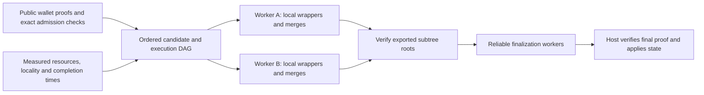

# Lattica throughput engineering analysis and project plan

> **PROPOSED / NOT IMPLEMENTED — 2026-10-01.** This extends the
> [distributed proving roadmap](distributed-proving.md) with a bandwidth model,
> hardware-aware pool design and a proposed capacity/cadence experiment.
> It does not change consensus, activate a profile or establish a measured
> throughput result. Existing [v2 gates](block-proving-v2.md) remain in force.

The selected [execution DAG and GPU implementation plan](dag-gpu-implementation.md)
sets the implementation priority: build a minimal local proof DAG alongside a
GPU pipeline that retains intermediate arrays. Complete the remote pool after
the local execution and performance prerequisites pass. The bandwidth models
and capacity/cadence proposals below retain their stated assumptions.

## Executive decision

Build a pool that assigns **complete, contiguous proof subtrees** to workers,
keeps intermediate proofs and matrices local, and exports independently verified
subtree roots. Schedule that work using a dependency DAG and measured worker
capabilities. Keep the block's ordered Merkle commitment and linear host-chain
consensus unless a separate consensus project justifies changing them.

The highest-value engineering decisions are:

1. Prioritize GPU transforms through commitments with retained intermediates,
   followed by quotient/opening/FRI work, to reduce complete proof latency.
2. Execute approved proof jobs as a dependency DAG; reduce transfers through
   subtree ownership, locality and immutable caches. Distribution alone cannot
   make a several-minute final merge fit a shorter finalization window.
3. Replace uniform job assignment with deadline- and resource-aware scheduling.
   A gaming PC, laptop and server should not receive identical work by default.
4. Evaluate **512 total transactions every three minutes**, then **4,096 every
   three minutes**, behind separate research profiles. Target useful rates of
   100 and 1,000 user transactions/minute, respectively, with declared reserves.
5. Use hash tables for exact operational indexes and Bloom filters for optional
   inventory hints. Neither changes proof soundness or replaces consensus checks.

The budget priority is the local GPU pipeline and minimal DAG harness before
remote fleet expansion or a large hardware purchase. Permissionless participation
and trustless payments are later projects; proof production is not mining consensus.

## 1. What the current project establishes

The review includes source and evidence available on 2026-10-01. The original
repeated-series snapshot at **18:00:30 UTC** has three completed trials and one
completed pair, not repeat qualification. The wider-lane source checkpoint at
17:40:03 UTC still has no successful native compile/test or full-size proof gate.

- CPU proving already uses parallel Plonky3/Rayon paths. Independent recursive
  stages currently run serially in the bounded research controllers.
- Candidate GPU acceleration covers salted leaf hashing and Merkle compression.
  DFT, quotient evaluation, opening reductions and FRI arithmetic remain CPU work.
- The GPU engine has a selected device, a mutex-protected engine and a global
  per-user process lease. Multiple GPUs need a new ownership/admission layer.
- Current full-size recursive stages use about **40 GiB of host memory**, under
  a **44 GiB worker cap**. Ordinary wallet proving has a different resource profile.
- Five matched GPU-retention pairs improved median four-transaction/seven-proof
  time from **19.627 to 17.642 minutes**. Local host-to-GPU uploads remained
  **328,028,118,272 bytes per trial**. These bytes are not WAN traffic.
- A grouped eight-wallet CPU pilot reduced recursive proofs from 15 to 7 and
  total time from **69.941 to 33.552 minutes**, but its final merge took 287.332 s.
  A separate fused-quotient CPU pair reached a **252.026 s** final merge. These
  are small research measurements, not high-capacity or distributed results.
- Candidate fixtures contain roughly **0.85 MB per wallet proof** and **1.91 MB
  per recursive proof**. Do not substitute historical v1 proof sizes into a
  network budget. New profiles may have different proof sizes and geometry.
- `src/node.zig` already uses `std.AutoHashMap` for anchors, nullifiers and a
  commitment index. Adding a hash table is not a missing cryptographic speedup.

References: [retention experiment](evidence/block-v2-retention-matched-2026-10-01.json),
[grouped pilot](evidence/block-v2-eight-matched-pilot-2026-10-01.json),
[fusion pair](evidence/block-v2-quotient-fusion-matched-2026-10-01.json),
[repeated-series status](evidence/block-v2-eight-repeated-series-2026-10-01.json),
[GPU engine](../lattica-prover-p3/src/block_v2/gpu_hash/engine.rs),
[node indexes](../src/node.zig).

## 2. Reduce network traffic at the correct boundary

Measure four traffic classes independently:

| Traffic class | Main reduction mechanism | Important limitation |
|---|---|---|
| Wallet proof ingress and public transaction data | One admission path, exact deduplication, local dispatch and independently validated proof-size work | The network still needs the public inputs; ciphertexts and proof randomness generally compress poorly |
| Intermediate proofs between workers | Own several proof stages on one worker; export subtree roots; place parent work near its inputs | Workers must still produce valid recursive proofs internally; locality does not remove that compute |
| Public programs, registered preprocessing and artifact inventories | Versioned caches, content digests, bounded Bloom-filter hints and batched requests | Caches consume resources and stale/adversarial inventory cannot be trusted |
| Local RAM, disk and PCIe transfers | GPU residency, tiling, transform/quotient fusion and fewer recomputations | This is a separate bottleneck; WAN optimization does not reduce it automatically |

### Subtree jobs, not one remote RPC per proof stage

Introduce a logical `SolveSubtree` operation over a fixed contiguous range of
approved public proofs and an externally pinned expected subtree statement.
The worker performs ordinary registered wrappers/merges locally and returns a
single subtree proof. Initial experiments use existing small trees and approved
constructions; the service operation is not a new production ABI or proof tag.

Distinguish **circuit grouping** from **scheduling locality**:

- `g` is the number of wallet proofs checked by a registered wrapper. Changing
  it changes the proving construction and requires registry/security review.
- `b` is the number of transactions assigned to a worker's local subtree. A
  worker can own `b=32` while executing existing `g=2` wrappers and binary merges.
  This does not require a new 32-witness batch circuit or access to wallet secrets.

Untrusted workers do not merely report that their internal jobs passed. The
coordinator verifies every **exported** subtree result against the approved
recursive verifier and expected statement. Recursive soundness must enforce the
internal verification chain. Requiring the coordinator to download all internal
proofs again would defeat the bandwidth benefit. Local checkpoints are a recovery
choice, not an additional historical-verification dependency.

### Illustrative transfer calculation

Assume a fully occupied 4,096-transaction tree, paired wrappers (`g=2`), equal
1.91 MB recursive proofs, and 0.85 MB wallet proofs. These sizes are borrowed
from small current fixtures solely to illustrate topology, not forecast a new
profile's actual wire sizes. MB/GB here are decimal.

If every proof stage is on a different worker, the recursive graph has
`2*(4096/2)-2 = 4094` child-to-parent proof edges. If each worker owns a
32-transaction subtree, the remaining cross-worker graph has 128 subtree roots
and at most `2*128-2 = 254` edges when all upper merges are remote.

| Single-copy logical payload model | Separate proof-stage placement | 32-transaction subtree placement |
|---|---:|---:|
| Intermediate proof transfers | 7.820 GB | 0.485 GB |
| One delivery of each wallet proof | 3.482 GB | 3.482 GB |
| Sum of those two classes | 11.301 GB | 3.967 GB |

This is approximately **94% less intermediate-proof traffic**, or **65% less
combined payload in this limited model**. It excludes extra gateway-to-worker
hops, verifier delivery, object-store replication, root publication, transaction
bodies, retries and framing. Record each actual network hop and its bytes; these
figures are not a measured total-system reduction. Co-locating verification and
storage can remove hops but cannot turn them into unreported costs.

Even with perfect subtree locality, 1,000 submissions/minute at 0.85 MB per
wallet proof is about **14.2 MB/s**, or **113 Mb/s**, of first-delivery payload.
Network budget must include this floor plus redundancy and body availability.
Cached proofs only save ingress for actual repeats, not new unique transactions.

### Artifact handling and recovery

- Store exact canonical artifacts under content digests; distinguish a verified
  semantic subtree identity from its randomized proof's exact byte identity.
- Send bounded manifests of digests/lengths instead of repeating proof bodies.
  Fetch missing bytes directly from authorized holders. Batch small requests
  and use persistent, authenticated encrypted connections with flow control.
- Keep program/registry caches immutable and profile-scoped. Cache deterministic
  public preprocessing, never proof randomness, hiding masks or wallet witnesses.
- Preserve input availability outside the assigned worker and make exported
  subtree proofs durable before releasing dependent jobs. Choose replication
  placement and count it in the network/cost budget.
- Tune `b` over 8/16/32/64 in qualified fixtures. Larger subtrees save transfers
  but increase tail latency, lost work on failure and assignment granularity.
- On unreliable workers, persist occasional **completed subtree proofs** as
  checkpoints. Interrupted stages restart with fresh randomness unless a
  separately validated resumable prover exists. Do not serialize live GPU state
  or transmit large matrices as the ordinary recovery mechanism.
- Bound optional compression by compressed and decoded length. Never promise
  large compression gains on cryptographic proofs or encrypted note data.

## 3. Data structures: recommended roles

| Structure | Use in this design | What it must not replace |
|---|---|---|
| **Execution DAG** | Dependency readiness, reusable subtrees across candidate versions, placement, cancellation and critical-path scheduling | Canonical transaction order, the cryptographic commitment or consensus |
| **Ordered Merkle tree** | Bind transaction order/count/type/context and recursive child statements; make affected-branch invalidation explicit | An exact state database or proof validation |
| **Content-addressed artifact graph** | Locate immutable proofs/programs and share identical artifacts across jobs | Data availability or authenticity of an unverified artifact |
| **Hash tables** | Exact job ID, lease, dependency, cache and nullifier indexes; sharded hot-path lookups | Durable recovery, deterministic iteration order or cryptographic commitments |
| **Bloom filters** | Compact approximate cache inventories and optional negative-lookup hints | Acceptance, spend-conflict decisions, proof verification or artifact availability |
| **Priority queues and timing wheels** | Ready jobs, deadline ordering and lease expiry | The durable job state machine and fencing |
| **Persistent key-value store / write-ahead log** | Exact authoritative state, atomic completion/dependency transitions, restart and reorg undo | The CPU verifier or host's canonical state-transition rules |

### DAG choice

Use a DAG for computation. A single binary proof tree is already a DAG; sharing
unchanged subtrees across candidate versions gives additional reuse. Acyclicity,
level monotonicity and allowed parent/child relationships must be checked.
Use dependency counters to make jobs ready when verified inputs are available,
and invalidate only descendants affected by a changed dependency or eligibility.

Parallel proof jobs do not imply independent state transitions. Admission and
candidate selection need exact nullifier/conflict checks; the host must still
validate the final ordered body and apply its state changes atomically. Reuse
only statements whose profile, registry, context, range and inputs still match.

A **DAG ledger** is a different proposal involving conflict ordering, consensus,
finality and economic security. It does not by itself reduce proving complexity
or resolve double spends. It is not part of this project plan. The host retains
one canonical ordered block body and one accepted final aggregate proof.

### Hash-table choice

Use expected-O(1) exact lookup for operational indexes, with bounded load factors,
capacity admission and adversarial-key testing. Evaluate keyed/randomized table
hashing where chosen keys could cause collision attacks. Keep the cryptographic
content hash separate from the in-memory table hash. Never serialize consensus
state using unspecified map iteration order. Persist exact indexes and reorg
changes transactionally; an in-memory hash table is not a production state store.

### Bloom-filter choice

For `n` items and desired false-positive rate `p`, use
`m = -n*ln(p)/(ln(2)^2)` bits and approximately `(m/n)*ln(2)` probes. At one
million entries and `p=0.001`, that is **14.38 bits/entry, about 1.71 MiB and
10 probes**, versus 32 MB just to enumerate one million 32-byte digests.

This reduces inventory exchange, not unique proof payload. A positive means
"possibly present": request/confirm the exact artifact when needed, then verify
its bytes and proof. A missing artifact must trigger another fetch/recompute;
it must not silently discard a transaction or satisfy a dependency.

Local negative membership can avoid a backing-store lookup only when the filter
is known complete for that exact database snapshot/generation. Stale filters,
reorgs, deletions and dishonest remote inventories violate that assumption.
Never reject a spend or approve absence based on an untrusted or stale filter.
Use generation-scoped immutable filters and rebuild/rotate them initially;
ordinary Bloom filters do not support safe deletion. Evaluate counting/Cuckoo
or static XOR alternatives only if measured update/space costs justify them.

## 4. Efficient compute and finalization

The current tens-of-GiB matrices and minutes-long stages dominate feasibility.
Prioritize work by measured cost per accepted transaction, not GPU marketing
throughput or transactions admitted into a queue.

1. Profile wall time, CPU work, allocation lifetimes, disk traffic and GPU event
   time independently. Avoid summing overlapping profiler spans. Separate
   startup/preprocessing, transfer, kernels, proof assembly and verification.
2. Extend GPU residency from transforms into commitments, then evaluate
   candidate-profile quotient/opening/FRI kernels as the primary acceleration
   work. Validate full proofs against CPU acceptance and count all transfers.
3. Reduce repeated verifier work through approved grouping and reuse of public
   preprocessing. Keep caches within worker limits and preserve fresh randomness.
4. Improve matrix layout and lifetime: fewer materialized copies, sequential
   access, bounded tiling and promptly released workspaces. A smaller RSS caused
   by increased disk I/O is not necessarily an efficiency gain.
5. Benchmark CPU SIMD, thread count and job concurrency together; pin NUMA memory
   near the assigned CPU/GPU. AVX-512-capable hardware needs an appropriate build
   and measurement; the current portable x86-64-v3 target selects AVX2.
6. Reduce circuit/trace geometry only through separately registered construction
   changes and full soundness/zero-knowledge review. Wider lanes, altered lookup
   layouts, larger wrapper groups and changed arity are experiments, not assumed
   wins. A wider proof can cost more despite fewer rows or tree levels.

### Critical-path budget

For the proposed three-minute cycle, use **60 seconds from selection seal to
host-ready root/body** as a research acceptance target. This is a service SLO,
not a new wall-clock consensus validity rule. Defer work that cannot fit; include
late issuance, public-data validation, transfer, retries and final verification.

As an illustration, 4,096 transactions assigned in 32-transaction subtrees leave
seven upper binary merge levels. If all seven remain at sealing and 10 seconds
are reserved for transfers/checks, the average sequential merge budget is about
**7.1 seconds**, not the current hundreds of seconds. A late issuance subtree
can leave still more work. Incremental preparation may shorten the remaining
path, but the benchmark must demonstrate this with real arrivals and context.

A tenfold faster final merge is a useful research checkpoint, not sufficient
evidence that the complete deadline passes. Do not commit to a production date
until an end-to-end path meets the proposed budget at full parameters.

### Fleet capacity and hardware cost

Size the fleet from measured service demand. For arrival rate `r` user tx/min,
`a_j` jobs of type `j` per user transaction, mean service time `t_j` seconds at a
fixed thread/device allocation, and target utilization `u`, a first estimate is
`concurrent worker slots >= r * sum(a_j * t_j) / (60 * u)`. Measure issuance,
padding, retries, verification and per-block fixed work separately and include
them in the demand. This estimates throughput capacity; the sequential deadline
and memory/CPU/GPU reservations are additional constraints.

With paired wrappers, a full `N`-transaction binary construction needs `N-1`
recursive stages, approaching one stage per transaction. As a **hypothetical
planning example**, even a five-second average stage at 1,000 total tx/min and
70% utilization needs at least **120 concurrent stage slots** before extra work.
At an unchanged 44 GiB reservation, that alone is about **5.2 TiB of reserved
host RAM**. Five seconds has not been demonstrated; different levels also have
different costs. This is why memory and compute per stage must fall together,
and why one large workstation cannot be assigned a credible 1,000-tx/min rating
from its core count. Recompute fleet cost from qualified profile measurements.

## 5. Proposed capacity and cadence specification

Preserve the **nominal 90-second PoW block interval** and evaluate transaction
blocks at every **second** height slot instead of every eighth. This changes
the nominal transaction-block interval from 12 to **3 minutes**, with one
heartbeat between transaction blocks. PoW arrival times remain stochastic;
three minutes is an expected cadence, not a clockwork inclusion/finality promise.

Keeping the nominal block interval avoids automatically shortening height-based
HTLC timeouts. It does not remove the need to review height pinning, anchor age,
reorg handling or public-proof reuse under the new state-change frequency.

| Profile proposal | Total capacity / tree depth | Nominal transaction interval | Cadence-only user ceiling with four reserved issuance slots | Useful-rate qualification target |
|---|---:|---:|---:|---:|
| Existing candidate | 64 / 6 | 12 min | 5/min | Existing v2 gates, not yet passed |
| First capacity experiment | 512 / 9 | 3 min | 169.3/min | 100/min sustained |
| Second capacity experiment | 4,096 / 12 | 3 min | 1,364/min | 1,000/min sustained |

Four issuance slots are a **conservative sizing reservation**, not the new payout
rule. The old eight-payee/four-issuance rule belongs to the old eight-slot cycle.
Specify and review the new producer/heartbeat payees, weights and actual issuance
transactions before implementing either profile. Fee-sniping incentives must be
reevaluated when a reward cycle contains fewer heartbeat miners.

### Required protocol and host changes

- Define new profile identities, explicit capacity/depth and bounded canonical
  counts. Current Rust/Zig summaries use `u8` counts and fixed depth-six checks;
  merely increasing `MAX_TRANSACTIONS` is incorrect. Select and test a bounded
  `u32` count encoding for the proposal, with checked arithmetic and matching
  Rust/Zig commitment and rejection vectors before allocating production tags.
- Review complete-tree soundness/hiding and recursive closure at each capacity.
  More statements require new accounting. Preserve historical verification and
  never lower security to meet the performance budget.
- Target a single final proof <=2 MiB, but require full-size evidence: changing
  capacity/geometry may change proof size. Failure blocks promotion; it does not
  authorize multiple roots, witness batching or an unchecked fallback.
- Specify heartbeat/transaction eligibility, subsidy settlement, fee allocation
  and emission conservation across activation. Preserve intended subsidy per
  elapsed target time; do not accidentally multiply issuance by paying an old
  12-minute amount every three minutes. Reevaluate difficulty/propagation and
  finality assumptions even though nominal header timing remains unchanged.
- Fix admission cutoff and sealing policy; derive issuance after selection and
  include its proof path in latency. Define underfilled/idle-block rules and
  missed-slot behavior explicitly without weakening proof acceptance. Simulate
  when a valid mining template becomes available: proof preparation that stalls
  mining can lengthen realized cadence despite an unchanged nominal PoW target.
- Bound block-body bytes, individual fields, relay cost, verifier work, state
  writes and recovery time in addition to transaction count. More frequent
  state-bearing blocks invalidate the old seven-heartbeat reorg-cost intuition.
- Evaluate anchor retention, HTLC height pinning, wallet retries, undo logs,
  snapshots, genesis replay and wallet scanning at the increased state rate.
- Stage activation by explicit host height/version and approved profile registry.
  Test old/new boundaries, reorgs across activation and deterministic rejection
  of mixed profiles. Any rollback is an explicit consensus policy, not a local
  prover downgrade after an invalid or late result.

The original 48 GiB RAM / 12 GiB VRAM / 128 GiB aggregate workstation gate remains
separate. Distributed reports must disclose all fleet/coordinator/store resources.
The host-chain implementation is outside this repository's audited proof core;
coordinate these changes with its owner rather than treating docs as activation.

## 6. Capability-aware pool, beyond a hash-share workload

Retain useful pool concepts such as authenticated sessions, assignment IDs,
bounded outstanding jobs, cancellation and accounting. Stratum implementations
already support heterogeneous hash rates and variants of job negotiation; the
difference here is the **dependency graph, data locality and varied resource
shape** of proof jobs, rather than a claim that mining protocols cannot adapt.

A valid hash share samples independent probabilistic search. A completed proof
is a verifiable result for specified inputs with predecessor jobs. There is no
useful universal conversion from hash-share difficulty to proof-job cost.

### Worker registration and qualification

Record CPU architecture/SIMD, usable cores and NUMA layout; physical RAM and
reserved headroom; GPU model, VRAM, driver/runtime and stable device identity;
actual PCIe link/NUMA placement; scratch capacity and sustained I/O; network
latency/bandwidth; temperature/power behavior; and available duty cycle.

Self-reports are hints. Qualify the exact backend/profile with known-correct
tests, then learn from completed real jobs, including failures and sustained
thermal behavior. Prevent replayed calibration proofs from inflating scores.
Track estimates by job type, profile, group/subtree size and resource allocation,
not just by device model. Requalify after driver, backend or firmware changes.

### Assignment policy

First reject workers lacking the required correctness qualification or resource
reservation. Then estimate completion from queue delay, missing-input bytes /
effective bandwidth, measured compute time, verification and retry risk. Among
workers meeting the deadline with margin, optimize cost/energy and locality.
Use measured end-to-end tail distributions where possible; sums of stage p95s
are not a proof of an end-to-end p95 bound.

| Worker property | Assignment response |
|---|---|
| High bandwidth, low latency, stable availability | Final levels and time-sensitive merges, if its compute is also fast enough |
| Powerful compute, slow WAN | Larger local subtrees and cached public preprocessing; export fewer roots |
| Many CPU cores, modest GPU | CPU-heavy phases or multiple bounded CPU jobs; no unsupported remote splitting of one proof |
| Strong GPU, limited host RAM | Only admitted jobs whose CPU/RAM stages fit; GPU speed does not waive host memory needs |
| Multiple GPUs | Initially one isolated worker/engine per device, explicit CPU/RAM/NUMA budgets and per-device leases |
| Intermittent laptop/desktop | Earlier, smaller qualified subtrees with sufficient retry slack; avoid the deadline-critical path |
| Low RAM | Qualified verification/admission support or future smaller proof classes; not today's full-size recursive stage |

Worker completion is credited once per accepted logical job/attempt according
to explicit pool rules. Publish job value before assignment, verify results,
and count retries/speculation in operator cost. Do not reward self-reported
FLOPs, runtime or progress percentages. Cryptographic receipts, work theft,
duplicate payments and coordinator nonpayment require a separate economic
protocol before claiming trustless permissionless operation.

## 7. Ideal worker and platform effectiveness

### Reference development/production-candidate worker

Start with **24–32 capable physical CPU cores, 128–256 GiB RAM, one qualified
16–24 GiB GPU, local NVMe scratch and a wired connection**. Expand to two GPUs
only after one-device contention and two-device scheduling are measured.

- Prefer four/eight memory channels for concurrent memory-heavy stages over
  assuming a high core count on a dual-channel platform will scale equally.
- For a cost-conscious DDR4 build, evaluate EPYC 7543P or a Threadripper Pro
  3975WX workstation; for DDR5, evaluate Threadripper 7960X/TRX50 or a suitable
  single-socket EPYC. The previously considered EPYC 9454P is a candidate when
  sustained utilization justifies its platform cost, power and cooling needs.
  These are candidates, not measured Lattica rankings.
- The available eight 32 GB Micron `MTA36ASF4G72PZ-2G3B1RK` DDR4-2400 RDIMMs
  total 256 GB and may make a compatible eight-channel DDR4 platform economical.
  Check the exact board, firmware, QVL and population rules before purchase;
  neither that compatibility nor a Lattica performance ranking is established
  here. These modules cannot transfer to a DDR5 board. Compare total platform
  cost, sustained memory bandwidth and energy before selling them.
- Reserve at least the current 44 GiB stage cap plus agent/OS/cache memory per
  concurrent full-size stage. A quiet 64 GiB host can be an entry worker, but
  gaming/background use may leave insufficient available memory. Start with
  two workers on a larger host and tune concurrency, rather than one per core.
- Existing NVIDIA tooling makes an RTX 5060 Ti 16GB a lower-integration-cost
  test card; an RTX 3090 24GB adds memory but substantial heat/power. Arc Pro
  B60 24GB is a qualification candidate, not a validated replacement. FP64,
  gaming frame rates and AI TOPS do not rank 64-bit field arithmetic reliably.
- Use direct PCIe slots with sufficient lanes and clearance. Aim for at least
  PCIe 4.0 x8 per GPU initially and x16 where the card supports it and transfers
  justify it; verify the actual link and chipset/NUMA path under load. VRAM is
  not pooled automatically and NVLink is not required for independent jobs.
- Provide roughly 1–2 TB or more of scratch capacity as an initial engineering
  allowance, adjusted to concurrency, cache retention, endurance and measured
  I/O. Capacity alone is not an IOPS/bandwidth guarantee. Prefer separate OS and
  scratch paths when measurements show contention.
- A stable wired 1 Gb/s connection can support initial workers if actual link
  utilization fits their assignments; high-duty-cycle finalizers may need more.
  Latency, data caps and sustained uplink matter more than an advertised peak.

### Relative platform effectiveness

These are engineering assessments, not measured speed or profitability ratios.

| Platform | Effective role | Strengths | Limiting factors | Recommendation |
|---|---|---|---|---|
| Gaming desktop | One proof worker when idle; early/middle subtrees | Good per-core speed, accessible GPU, upgradeable cooling | Dual-channel memory, often only 32 GiB RAM, second GPU slot bandwidth/clearance, owner interruptions | Good entry worker with 64+ GiB and adequate VRAM; benchmark sustained jobs and reserve resources |
| Gaming laptop | Development, smaller qualified tasks or opportunistic early work | Existing hardware, useful single-device testing | RAM/VRAM limits, shared thermal/power budget, Wi-Fi, sleep and low duty cycle | Do not make a typical 16/32 GiB laptop a current full-stage worker; 64 GiB models can qualify but are poor dependable finalizers |
| Workstation | Main pool worker and controlled finalizer | More memory channels, ECC options, PCIe lanes, sustained cooling | Higher acquisition/idle cost; workstation label alone does not guarantee eight-channel memory | Best balance for a small operator; single socket, 128–256 GiB and one/two GPUs |
| Server | Stable pool infrastructure, multiple workers and finalization | High memory bandwidth/capacity, remote management, reliable cooling/networking | Rack noise/power, possible low clocks, NUMA and shared I/O, GPU qualification | Best at sustained utilization in suitable premises; prefer measured single-socket configurations before dual socket |

Assign stages by observed performance rather than these labels. A modern gaming
desktop can beat an older server on one proof, while the server wins aggregate
throughput through memory capacity and channels. Track useful proofs/second,
accepted transactions/joule, deadline hit rate and amortized cost—not raw cores
or GPU count. For an apartment, a tower workstation is usually easier to cool
quietly than a rack server; almost all wall power becomes room heat.

## 8. Engineering project plan

Planning assumption: **4–6 engineers**, covering prover/GPU performance,
distributed systems, protocol/host integration and validation, plus independent
cryptographic review. The [implementation plan](dag-gpu-implementation.md) defines
interfaces and evidence gates. GPU pipeline work begins after P0 and runs
alongside the minimal local DAG; it does not wait for P3's remote pool.

| Work package | Indicative effort window | Deliverables | Exit gate |
|---|---:|---|---|
| P0: measurement and interface baseline | 1–2 weeks | Pinned fixtures, current CPU/GPU controls, job/device contracts, byte/resource/critical-path measurements | Reproducible phase and byte counters with externally expected statements |
| P1: GPU pipeline, primary performance work | 8–16+ weeks, feasibility-dependent | Retained transform-to-commitment buffers, then quotient/opening/FRI, tiling, admission and qualified per-device execution | Full-strength CPU-verified proofs and matched end-to-end improvement under declared budgets; replan if finalization remains implausible |
| P2: minimal local DAG and exact state | 2–4 weeks, alongside P1 | Dependency readiness, subtree ownership, immutable artifacts, durable attempts, completion fencing and recovery | Serial-equivalent expected statements; shuffled completion, cancellation, restart and malformed/stale result rejection |
| P3: remote subtree pool | 4–6 weeks after local prerequisites | Two/four-host public-only execution, capability/locality placement, direct retrieval and recovery checkpoints | Measured network reduction and scaling, worker/coordinator recovery, CPU root replay without inner artifacts |
| P4: capacity and cadence profiles | 4–8 weeks after construction feasibility; host work partly parallel | 512/4,096 profiles, bounded counts, Rust/Zig vectors, reward/emission rules, activation and full-type/height/reorg handling | Complete-tree security, recursive closure, bounded proof/body sizes and deterministic host behavior |
| P5: qualification and staged rollout | 4–8+ weeks after P3/P4 | Arrival-driven testnet, heterogeneous pool, fault runs, hardware/cost report and operations runbooks | Throughput and complete finalization gates, independent review and explicit host activation |

Fund P0–P2 first. P1 is the main performance research risk; use its measurements
to size hardware and decide whether P3/P4 are viable. These windows are planning
estimates, not a production-date commitment. Permissionless payments remain a
separate project.

### Proposed acceptance criteria

- **Network:** at least 80% less measured intermediate cross-worker proof traffic
  than separate-stage placement on the same qualified workload, with a fixed
  replication/failure policy. Report total bytes separately, including ingress,
  coordinator verification, storage replication, checkpoints and retries.
- **Compute:** demonstrate the entire sealed critical path within the proposed
  60-second budget under declared resource/fault limits; do not substitute the
  last kernel or merge timing. Include late issuance and height/context effects.
- **Scale:** target at least 70% throughput scale-out efficiency on identical
  two/four-host configurations; report heterogeneous pools by their measured
  resource/cost allocation rather than dividing by arbitrary machine count.
- **Cadence/capacity:** sustain 100 user tx/min on the first profile, then 1,000
  on the second, with no sustained backlog growth. Report actual accepted user
  transactions, issuance, deferrals and failures separately. Do not claim the
  ceiling derived from block arithmetic as measured useful throughput.
- **Duration:** at least 24 hours and 100 complete root cycles, whichever is
  longer, after reported warm-up. Include cold-cache/startup runs, bursts, mixed
  transaction types, padding, underfilled blocks and complete state application.
- **Faults:** inject worker loss, slow/lying inventory, malformed results,
  coordinator failover, cache corruption and bounded partitions. Safety holds
  regardless of capacity; deadline recovery is assessed within a declared spare
  budget and missing it is reported. Never silently switch acceptance paths.
- **Economics and operations:** publish wall energy and cost per 1,000 accepted
  user transactions, bytes per accepted transaction, resource peaks, deadline
  distributions and fleet utilization. Set a budget ceiling before each scale
  trial; low backlog obtained by throwing unlimited hardware at it is not an
  efficiency result.
- **Release:** CPU-only final verification after inner-artifact pruning,
  historical compatibility and externally reviewed full-tree security remain
  mandatory. A successful distributed demo is not production consensus approval.

## 9. Recommended first experiment

Use one controlled host, one qualified GPU and an existing registered public
workload. Pin its CPU reference and retained-hash control. Build a minimal local
DAG around the same operations and prototype a candidate transform feeding the
commitment engine without a full intermediate download/re-upload. Run complete
proofs, unchanged CPU verification and matched resource/transfer measurements.

Once the local pipeline and ownership gates pass, compare one/two-device jobs,
then separate-stage versus complete-subtree placement on two controlled hosts.
Keep inputs, parameters, resource allocations, replication and deadlines fixed;
account for all transfers and test worker loss. This isolates locality benefits
from cryptographic construction changes.

Measure the remaining post-seal path throughout. If it cannot approach the
cadence budget, continue prover optimization or revise the research proposal
before implementing high-capacity consensus activation.
