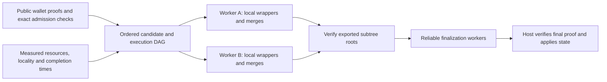

# Lattica throughput engineering analysis and project plan

**Current priority — 2026-10-06:** qualify four useful user transactions/minute
on the current workstation, using the gated [two-hour development pilot](benchmarks/README.md#two-hour-throughput-pilot).
The retained [readiness JSON](evidence/block-v2-throughput-readiness-2026-10-06-r39.json)
records passed checks and blockers. The larger capacity/cadence and remote-fleet
proposals below remain later research work; their earlier source snapshot is
historical. Apple silicon uses the same portable result format to measure
development milestones.

### Work completed after the Apple merge

The merged baseline is revision `094cade`. Both NVIDIA GPUs completed an
eight-wallet run with seven fresh recursive proofs and an independent CPU root
audit. The recorded worker times were **224.395 s** and **257.327 s**. These are
calibration observations with different device budgets; they do not establish a
matched speedup. The [baseline JSON](evidence/block-v2-merged-baseline-2026-10-04.json)
retains source and binary hashes, resource limits, results and profiles.

The direct-readback candidate removes the second host matrix used during the
final reorder. Its planner now admits two workers within the existing RAM and
spill margins. Unit checks and fixed-seed GPU equivalence checks passed on both
cards. Full-size runs with the calibrated **512 MiB context allowance per GPU**
also passed both independent CPU root audits: **214.463 s** and **270.021 s**,
with no memory-limit or OOM events. Concurrent admission now passes.

Five alternating sequential/concurrent pairs completed **20 independently
CPU-audited subtree jobs**, with seven fresh recursive proofs per job:

| Execution | Median two-job elapsed time | Median audited eight-wallet subtree jobs/hour |
|---|---:|---:|
| Sequential on one GPU | 415.724 s | 17.319 |
| Concurrent on two GPUs | 303.920 s | 23.690 |

The median reduction within matched pairs was **26.049%**, ranging from
**19.240% to 32.618%**. Median within-pair throughput increased **35.224%**.
Sequential pairs took 410.973–450.391 s; concurrent pairs took
303.032–335.739 s. The slower final concurrent pair is retained. Timing includes
controller startup, fixture copying, worker execution, CPU audits and cleanup.
All memory-limit and OOM counters stayed at zero, and all 20 root hashes were
distinct. These jobs reuse public wallet proofs and do not measure delivered
transactions. The [candidate JSON](evidence/block-v2-direct-readback-2026-10-04.json)
retains device-specific budgets, checks and results.

Five further alternating banded/direct pairs passed **10 independent CPU root
audits and 70 fresh recursive proofs**, with equal assigned GPU, CPU, RAM and
spill limits. Median worker time fell from **231.583 s to 217.021 s**. The median
reduction within pairs was **5.391%**, ranging from **2.066% to 12.740%**; all five
pairs favored direct decoding. All memory-limit/OOM counters remained zero.
The original campaign's controller error and its successful underlying proof
job are retained separately. Direct readback is recommended for newly qualified
Linux grouped-eight research runs and remains an explicit configuration choice.
Mixed roots still need their own qualifications. Removing the reorder buffer
reduces the admission model's peak; later phases still dominate measured
whole-job memory, so the removed allocation is not a claimed whole-job RAM saving.

The [Mac benchmark package](evidence/block-v2-apple-benchmark-package-2026-10-04.json)
is prepared: pinned merged proof sources, the public fixture, nine fresh Metal
trials, hardware qualification, independent CPU root audits and portable JSON
export. Its instructions are in
[`apple-benchmark-package-README.txt`](../lattica-prover-p3/scripts/apple-benchmark-package-README.txt).
Mac execution remains pending. The three settings measure quotient control,
deferred timing, and compact prover data with deferred timing on the same Mac.

The [mixed-root research tooling](evidence/block-v2-typed-tooling-2026-10-04.json)
prepares 64 distinct public transactions under a shared anchor, groups wrappers
by type while preserving tree order, pads to depth six, and exposes an independent
CPU root/body audit. Rust and Zig agree at all nine required counts. The CPU
reference plans **127 recursive proofs for 64 transactions**.

The first [mixed GPU root](evidence/block-v2-typed-gpu-2026-10-04.json) passed:
**four ordered inputs** (JoinSplit, HTLC redeem, HTLC refund and issuance),
**15 fresh recursive proofs**, **515.810 seconds**, and a **1,683,948-byte root**.
A separate CPU process audited the root, public body, expected policy and five
trusted keys without wallet or intermediate proofs. All six negative audits
rejected altered root, height, issuance, body order, proof bytes and registry key.

That run used the laptop GPU, 23 Rayon threads, a 36.5 GiB worker cap, 7 GiB
managed GPU memory and a provisional 7.25 GiB context allowance. Peak charged
RAM was **17,066,856,448 bytes**, with zero memory-limit or OOM events. The
observed context peak was 209,713,424 bytes across 66 samples; this observation
does not qualify a smaller allowance. CPU fixture/key preparation separately
took 280.000 seconds. Other counts, devices, budgets, concurrent mixed jobs and
durable host application remain unqualified. Instructions are in
[`typed-benchmark-README.txt`](../lattica-prover-p3/scripts/typed-benchmark-README.txt).

Corrected profiling now includes the adapted quotient, FRI and opening modules.
Four canonical empty proofs took **141.927 seconds** and four padding merges took
**108.044 seconds**: together **249.971 seconds, or 48.462% of this count-four
job**. These node intervals are sequential and disjoint. The CPU quotient
polynomial span was 132.439 seconds and GPU opening span was 108.367 seconds;
these inclusive phase spans overlap with other work and must not be summed.
Batch inversion, SIMD evaluation and Rayon parallelism already exist.

The [finalizer compiler prototype](evidence/block-v2-typed-finalizer-2026-10-04.json)
uses a separate six-key research registry. Its constraint checks cover every
count from 1 through 32 and reject altered child statements using a real inner
proof. The finalizer has **129,983 active rows** and fits the current 262,144-row
shared height. For count four, its plan uses **eight recursive proofs instead of
fifteen**.

The first [finalizer GPU qualification](evidence/block-v2-typed-finalizer-gpu-2026-10-04.json)
now passes. All six registry keys were prepared on the CPU, and the separate
finalizer executable produced **eight fresh recursive proofs in 249.370 seconds**
for the same four public inputs: three user transactions and one issuance.
Its **1,683,948-byte root** passed an independent
root-only CPU audit in **0.074 seconds**. Seven mutations were rejected, including
substitution of the finalizer registry key. Peak charged RAM was
**17,037,471,744 bytes**, with zero memory-limit or OOM events.

This run used the laptop GPU, 23 Rayon threads, a **40.75 GiB worker cap**, 7 GiB
managed GPU memory and the provisional 7.25 GiB context allowance. The observed
context peak was 209,713,424 bytes across 38 samples. No resource margins were
reduced. Six-key CPU preparation took **314.126 seconds**, reusing all 64 pinned
public leaf proofs and generating fresh registry keys. The worker timing excludes
that preparation and wallet proving.

The historical reference took 515.810 seconds under an earlier binary and a
36.5 GiB worker cap. These are unmatched observations; the comparison below
supplies the repeated measurement with equal resource assignments. Other mixed
counts and concurrent mixed jobs remain unqualified. Compact admission on each
device is qualified below. The
full-64 construction still needs 127 recursive proofs.

The [five-pair comparison](evidence/block-v2-typed-comparison-2026-10-04.json)
is complete. All ten fresh roots passed independent CPU audits, covering
**115 recursive proofs**. Reference median worker time was **439.256 seconds**;
finalizer median was **252.768 seconds**. The median reduction calculated within
matched pairs was **41.893%**, ranging from **41.231% to 50.043%**; the finalizer
was faster in all five pairs. Both constructions used the same public inputs,
shared height and pinned CPU, RAM, spill and GPU limits. All worker memory-event
counters were zero, and six mutations of a reference root were rejected.
This establishes a count-four aggregation milestone on the laptop GPU. It does
not include wallet proving or durable host application.

The [compact-memory qualification](evidence/block-v2-typed-compact-multi-gpu-2026-10-04-r2.json)
now passes on each GPU. Compact GPU storage was already enabled; the change
replaces the full retained-LDE admission bound with the bound for that storage
mode while retaining the phase memory model and resource margins. The new
code passed **26 Rust test executions and 32 Python tests**.

Both devices produced fresh count-four finalizer roots under an **18 GiB worker
RAM cap**, **14.25 GiB spill cap** and **37.5 GiB shared fleet cap**, running one
at a time with the two-worker allocation. The laptop worker used 12 Rayon
threads and took **286.348 seconds**; the desktop worker used 11 and took
**356.722 seconds**. Both roots passed independent CPU audits, remained
**1,683,948 bytes**, and had zero worker and parent memory-event deltas. Seven
mutations of a new root were rejected. Earlier successful sequential runs at
19.25 GiB per worker are also retained.

**Concurrent count-four qualification now passes on both GPUs.** The new
memory check found **44.792 GiB available** against **43.722 GiB required**;
the frozen controller rechecked capacity before launch. The concurrent roots
completed in **302.468 seconds** on the laptop GPU and **376.764 seconds** on
the desktop GPU. Both passed CPU root audits with **eight fresh proofs per
root**, **1,683,948-byte roots**, and zero worker or parent memory-event deltas.
Peak charged RAM was **15.716 GiB** and **15.685 GiB**, below the 18 GiB caps.
Worker cleanup and artifact pins passed validation.

The matched execution windows were **644.409 seconds sequentially** and
**377.215 seconds concurrently**, a **41.463% reduction** for this pair. The
window includes worker launch, fixture copy, proving, CPU audits, polling and
cleanup. It excludes registry preparation, wallet proving and durable host
application. This single pair established correctness and supplied one timing
observation. The repeated calibrated comparison below is now complete. Each GPU produced an
independent root. Both earlier admission failures remain in the evidence.

[Exact-profile context calibration](evidence/block-v2-typed-calibrated-multi-gpu-2026-10-04.json)
now passes on both GPUs, sequentially and concurrently. Each device supplied
76 context samples from two prior audited roots. The laptop peak was about
**200 MiB** and the desktop peak about **266 MiB**. Applying the existing
125% margin and 512 MiB floor gives **512 MiB per GPU**. Managed VRAM remains
**7 GiB / 5.5 GiB**; CPU, host RAM, spill and other margins are unchanged.

The calibrated pair produced **four CPU-audited roots and 32 fresh proofs**,
with zero worker and parent memory-event deltas. Sequential execution took
**591.666 seconds**; concurrent execution took **356.284 seconds**, a
**39.783% reduction** in this pair. This qualifies the calibrated allocation;
it does not establish a performance change caused by lowering the allowance.
The controller and comparison runner passed **34 Python tests**. The prover
binaries are unchanged, and their 156 captured source files were revalidated.

[Repeated calibrated fleet qualification](evidence/block-v2-typed-calibrated-repetitions-2026-10-04.json)
has passed all **five alternating matched pairs**. All **20 roots** passed
independent CPU audits, covering **160 fresh recursive proofs**, with zero worker
or parent memory-event deltas. Input, binary, resource-assignment and artifact
hashes were revalidated, and worker cleanup passed. Each GPU produced an
independent count-four root with three useful inputs and one issuance.

| Execution | Median two-root window | Useful fixture inputs/minute |
|---|---:|---:|
| Sequential under the fixed two-worker assignment | 569.195 s | 0.626 |
| Concurrent on both GPUs | 356.284 s | 1.006 |

The median reduction within matched pairs was **37.957%**, ranging from
**35.655% to 39.783%**. Concurrent execution was faster in all five pairs.
Rates divide 30 audited useful inputs per arm by that arm's total measured
window time. Issuance, wallet proving, registry preparation and durable host
application are excluded. These are aggregation milestones; delivered
transaction throughput remains unmeasured. The report now selects this repeated
mixed-root comparison and withholds rates for incomplete campaigns. Its
**40 Python report tests** passed.

[The paired typed compiler](evidence/block-v2-typed-pairs-compiler-2026-10-04.json)
now passes interpreter and geometry checks under a separate twelve-key registry.
All sixteen ordered combinations of the four fixture types passed, including
HTLC redeem/refund, forged left/right proofs, count-one padding and registry
mutations. A real small child proof exercises the finalizer's inner verifier;
forged statements and a finished child are rejected. **17 Rust tests passed**,
including regressions for the existing registries.

Every program fits the **262,144-row shared height**. The merge uses **260,059
active rows**, leaving only 2,085 rows of margin. The proof plan changes
count-four from **8 to 4 proofs** and full-64 from **127 to 63**. These compiler checks preceded the first paired GPU qualification below. The six-key fleet
qualification above remains specific to that earlier construction.

[The first paired GPU root](evidence/block-v2-typed-paired-gpu-2026-10-05.json)
now passes its independent CPU audit. The new session, probe, worker profile and
key format use twelve trusted keys. **50 Rust tests and 53 Python tests passed**;
Rust and Zig agree on native commitments and plans for all nine required counts.
CPU preparation generated twelve fresh keys from 64 pinned public wallet proofs
in **524.153 seconds**.

On the laptop GPU, count-four required **four fresh recursive proofs in 133.268
seconds**. The **1,683,948-byte root** passed a separate CPU audit in **0.076
seconds**, and all seven mutated-root audits rejected their inputs. Peak charged
RAM was **15.833 GiB**, with zero memory-limit or OOM events. This run used 23
Rayon threads, a 38.75 GiB worker cap, 7 GiB managed GPU memory and a provisional
7.25 GiB context allowance. Worker time including fixture copy and CPU audit was
**133.366 seconds**. Wallet proving, registry preparation and durable host
application are excluded. This first run established correctness for one assignment.

[The five-pair finalizer/paired comparison](evidence/block-v2-typed-paired-comparison-2026-10-05.json)
now passes on the laptop GPU: **10 independently CPU-audited roots and 60 fresh
recursive proofs**. Median worker time fell from **238.312 seconds** with eight
finalizer proofs to **135.675 seconds** with four paired proofs. The median
reduction within matched pairs was **43.068%**, ranging from **42.357% to 43.418%**;
paired proving was faster in all five pairs. Both arms used the same four public
inputs, 23 Rayon threads, a **35 GiB worker RAM cap**, 25.75 GiB spill reservation,
7 GiB managed GPU memory and the provisional 7.25 GiB context allowance. All
source, binary, controller and root hashes were revalidated; every worker memory
event counter was zero. Useful fixture aggregation rates were **0.756 / 1.326
inputs per minute**, excluding issuance, wallet proving, registry preparation
and durable host application. The report now imports matched construction
windows and withholds both rates if a trial, source pin or run mapping is incomplete.
This qualification does not transfer the six-key fleet's context measurements
to paired proving.

[Paired per-device calibration](evidence/block-v2-typed-paired-calibration-2026-10-05.json)
now passes on both GPUs. The desktop GPU produced four fresh proofs in
**171.875 seconds**, with an independent CPU audit, a 1,683,948-byte root,
**15.762 GiB** peak charged RAM and zero memory events. This standalone run used
23 Rayon threads, 38.75 GiB worker RAM, 28.75 GiB spill, 6 GiB managed GPU memory
and a provisional 6.5 GiB context allowance; its worker boundary was 171.973 seconds.
Measured context peaks were **200 MiB on the laptop GPU / 266 MiB on the desktop**.
The policy of 125% measured peak, rounded up with a 512 MiB minimum, admits
**512 MiB per GPU** for this exact paired binary, profile, driver and allocation.
The calibration loader now follows pinned shared assignment files and validates
automatically assigned budgets against the retained admission, worker and result
records. **34 controller tests pass**; both earlier preparation failures remain saved.

The new fixed paired fleet assignment uses **12 / 11 Rayon threads**, **7 / 6 GiB
managed GPU memory**, **18 GiB RAM and 14.25 GiB spill per worker**, and a
37.5 GiB fleet cap with no swap. Live admission passed with 46.208 GiB available
RAM. [Five alternating sequential/concurrent pairs](evidence/block-v2-typed-paired-repetitions-2026-10-05.json)
completed with **20 independently CPU-audited roots and 80 fresh proofs**.
Median two-root elapsed time was **316.521 seconds sequential / 197.872 seconds
concurrent**. The median reduction within pairs was **37.486%**
(36.249–37.855%); concurrent execution was faster in all five pairs.
Useful fixture throughput was **1.138 / 1.813 inputs per minute**, excluding
issuance, wallet proving, registration and durable host application. All worker
and parent memory-event deltas were zero. Each GPU proves an independent root;
these results cover count four and the exact pinned assignment above.

[Paired phase profiling](evidence/block-v2-typed-paired-phase-profile-2026-10-05.json)
identifies quotient computation and opening work as optimization targets. The
median FRI query span was **12.021 seconds**, including transforms, transfers and
proof assembly. Inclusive phase spans overlap and cannot be summed.

The opt-in query-gather implementation passed GPU reconstruction checks on both
cards and a [full-size count-four root qualification](evidence/block-v2-query-gather-gpu-2026-10-05.json)
on the laptop GPU, including seven rejection tests. Its
[five matched row/gather pairs](evidence/block-v2-query-gather-comparison-2026-10-05.json)
produced **10 CPU-audited roots and 40 fresh proofs**, with zero memory events.
Median worker time was **133.599 seconds rows / 133.298 seconds gather**. The
median within-pair reduction was **0.225%**, ranging from **−0.668% to 0.918%**;
gather was faster in three of five pairs. Useful fixture rates were
**1.348 / 1.350 inputs per minute** under the same binary and resource assignment.

Gather reduced downloads from **15,360 to 120** per root, with the same
**1,933,312 bytes** downloaded. Median query reconstruction time remained
**10.869 / 10.878 seconds**. This experiment does not establish a consistent
solving-time improvement, so **row readback remains the default**. The Metal
implementation remains untested on a Mac. The controller and report now pin the
query mode and reject incomplete or inconsistent comparisons.

The [count-matrix controller](evidence/block-v2-typed-count-matrix-tooling-2026-10-05.json)
is implemented and frozen. It revalidated both existing count-four roots and
runs new counts serially with conservative admission based on the actual GPU,
CPU capacity, available RAM and spill space. It does not transfer count-four
context calibration to other counts. **155 controller and report tests pass**.

The [completed count matrix](evidence/block-v2-typed-count-matrix-2026-10-05.json)
passes **all 18 count/device combinations**: counts **1, 2, 3, 4, 8, 16, 32, 63
and 64** on each GPU. Final analysis revalidated **16 new CPU-audited roots and
380 new recursive proofs**, plus two retained count-four roots containing eight
prior proofs. All completed roots are **1,683,948 bytes** and passed independent
root-only CPU audits. The matrix used serial jobs with conservative per-device
admission; it does not qualify concurrent larger-count allocations.

| Count | Laptop worker time | Desktop worker time |
|---|---:|---:|
| 32 | 889.233 s | 1,134.572 s |
| 63 | 1,697.505 s | 2,186.264 s |
| 64 | 1,692.217 s | 2,201.471 s |

These intervals include fixture copying, recursive proving and CPU root audit.
They exclude wallet proving, registry preparation and durable application.
There is one trial per count/device, so this is count coverage rather than a
repeated timing comparison. The count-64 fixture rates are **1.702 / 1.308 useful
inputs per minute**, excluding issuance. Neither run qualifies the **600-second
complete cold-full-64 target** or delivered transaction throughput.

The [count-level phase analysis](evidence/block-v2-count-phase-analysis-2026-10-05.json)
validates profiling counters for all 18 roots. **Eight count-analysis tests and
six phase-analysis tests pass.** At count 64, preprocessing ran only three times:
**20.835 / 26.805 seconds**. The existing one-program cache already reuses setup
over grouped modes. CPU quotient-polynomial spans were **455.096 / 456.824
seconds**; GPU opening spans were **385.977 / 658.424 seconds**. Inclusive spans
can overlap other reported work and must not be summed. These observations
prioritize quotient and opening work over more preprocessing caching for full
trees; they do not establish a new optimization's speedup.

The [native host validation](evidence/block-v2-host-validation-2026-10-05-r4.json)
now passes all **11 steps**: 13 Python persistence tests, seven native application
tests, four complete-body codec tests, a genesis fixture test, the full Zig
regression suite, four Rust ABI tests, library/probe builds, bridge linkage, two
fresh wallet fixtures and real-verifier interoperability. Both fixtures contain
four fresh CPU-verified leaves and recipient-decryptable outputs. Native bodies
and Rust leaf statements produce the same ordered root. The ciphertext API now
exposes read-only slices; chain application still makes owned copies. The earlier
compiler and tagged-union test failures remain retained with their source archives.

The [positive native journal qualification](evidence/block-v2-native-host-qualification-2026-10-05.json)
passes **55 checks using real proofs**. Two matching count-four recursive roots
passed independent CPU audits in **132.709 / 132.906 seconds**. Native application
then verified exact supply, notes, nullifiers and events; retained complete
ciphertexts and root proofs; reopened state in a fresh process; and handled reorg,
rollback and stale writers. Recovery passed five process-exit boundaries, ten
injected ENOSPC/EIO cases and two writers released together. One warm commit,
including history replay, took **0.109 seconds**; this is not a full-process
throughput measurement.

The [multi-height delivery qualification](evidence/block-v2-native-delivery-2026-10-05.json)
now passes **41 checks** with **four independently CPU-audited roots**: three
consecutive blocks at heights **10, 11 and 12**, plus an alternative height-11
branch. Exact supply, notes, nullifiers and events survive fresh-process restart,
rollback and branch replacement. Stale prepared results and mismatched ancestry
are rejected. All four participants were exercised, including the last of **704
funded slots**. Wallet preparation uses the verified chain's current anchor and
next height. The controller now accepts an independently pinned host expectation;
the original synthetic fixture command retains its height-10 policy.

The four worker observations were **143.553, 138.824, 142.114 and 145.093 seconds**;
native commits including replay took **1.997–2.446 seconds**. Preparation through
commit took **164.031–171.206 seconds** for four transactions. These include
qualification policy checks, use prebuilt registry inputs, and do not qualify
full-64 cold timing or the complete post-seal boundary. No performance speedup is
claimed. Failed attempts, an earlier successful root and all source snapshots
remain retained; this work unit produced five audited roots in total.

This bounded journal replays at most 128 blocks per commit. Sustained arrival-driven
delivery, proving-worker termination through that backend, and physical power-loss
recovery remain unqualified. The two-hour pilot has not started.

[Typed scheduler and recovery evidence](evidence/block-v2-typed-local-dag-2026-10-05.json)
now covers all counts 1–64, all nine ordered type pairs, odd-tail padding and
depth-six finalization. All 153 enabled execution tests and six paired-probe tests
pass; 46 opt-in execution tests remain unrun. CPU diagnostics checked the nine
retained count plans and reopened four native-root graphs at heights 10–12 and
the alternate height-11 branch. Recovery independently reverified all 16 retained
nodes, and root export rejected a changed host-head token. Checkpoint recovery
also rejects an operation tag that differs from the verified inputs.

That artifact replay produced no new proofs or native commits. The journal was
reopened within the diagnostic process.

The [typed GPU worker qualification](evidence/block-v2-typed-worker-2026-10-05.json)
adds separate typed packets, cached preprocessing and persistent resource
reservations. Idle caches keep their RAM, managed VRAM and spill reservations
with zero CPU slots. Jobs drain GPU queues before reconciliation; workspace
reservations are released after GPU teardown. All 159 enabled execution tests,
nine paired-probe tests, 18 single-GPU controller tests and 16 fleet-controller
tests pass. The report retains execution identity, per-node cache counters and
CPU verification/proving/serialization timings; its 37 Python checks pass.

The same frozen GPU binary produced four standalone CPU-audited roots:

| Inputs | RTX 5080 Laptop worker time | RTX 5080 desktop worker time | Cache setups / hits per root |
|---|---:|---:|---:|
| 4 | 153.804 s | 178.263 s | 4 / 0 |
| 8 | 280.852 s | 331.156 s | 4 / 4 |

A subsequent **concurrent eight-input trial passed on both GPUs**. The two
workers took **375.187 s** and **421.924 s**; the complete fleet execution window
was **422.634 s**. Both independent CPU audits passed, with eight fresh proofs
and four cache hits per root. Each worker had **22.25 GiB RAM** and **14.25 GiB
spill**, inside a **45.75 GiB fleet cap**. Rayon used 12/11 threads; managed VRAM
was 7/6.5 GiB and conservative context allowances were 7.25/7 GiB. Peak charged
RAM stayed below 15.7 GiB per worker. All worker and parent memory-limit/OOM
counters were zero. This binary's smaller context allowances remain unqualified.

These six roots contain **40 fresh recursive proofs**, using retained public
wallets and keys. Each process owns its own DAG and cached worker. The
standalone and fleet allocations differ, so these observations do not establish
a matched speedup. The initial capacity-check failure remains retained; it
produced no proofs. No new wallet proofs or native blocks were produced.

[Completed-journal recovery](evidence/block-v2-typed-recovery-2026-10-05.json)
now passes in two fresh CPU processes against one dedicated eight-input GPU
journal. The new GPU run produced **eight fresh recursive proofs in 314.562 s**,
including its independent CPU root audit, with zero memory-limit/OOM events.
Recovery advanced the original journal to epochs **2 and 3**, reverified all
eight cached nodes, returned the byte-identical root and released all resources.
Each CPU recovery took about **4.676 s** and started zero prover jobs. Four
separate processes rejected a wrong budget, wrong head, stale epoch and corrupted
root without changing the journal. Original and post-recovery archives, process
logs, hashes and the corrected controller failure are retained. Nine CPU probe
tests, twelve GPU probe tests and five controller tests pass. Active worker
termination and native arrival integration remain open.

[Persistent GPU child dispatch](evidence/block-v2-typed-process-2026-10-05.json)
now passes for **one eight-input root on the laptop GPU**. A separate DAG owner
CPU-verified each returned node while one child reused preprocessing across all
eight jobs. The worker window, including independent root audit, was **250.478 s**;
the child recorded **four setups and four cache hits**. GPU teardown and successful
child exit preceded workspace release. Peak charged RAM was **15.97 GiB**, with
zero memory-limit/OOM events. This used 23 Rayon threads, a 44.75 GiB worker RAM
cap, 7 GiB managed VRAM and the conservative 7.25 GiB context allowance.

The corrected implementation passes **164 execution tests**. The first trial's
cache-counter error, one verified node and original journal are retained. The
successful run's benchmark monitor was interrupted; the original DAG owner and
GPU child continued, and terminal observation recovered the completed result.
Host telemetry therefore has a documented gap. Worker timing, all 37 recorded
GPU context samples and final cgroup peak/event counters remain retained. This
is a dispatch milestone; it does not establish a matched speedup or active-worker
recovery. The follow-up qualification below extends the device and concurrency
scope while retaining that first trial and its monitoring limitation.

[Desktop and concurrent persistent-child qualification](evidence/block-v2-typed-process-concurrent-2026-10-05.json)
adds **three CPU-audited roots and 24 fresh recursive proofs**, using the same
frozen binary. The standalone desktop root took **291.247 s**, with **15.966 GiB**
peak charged RAM. The concurrent laptop/desktop roots took **303.486 / 342.703 s**;
the complete fleet execution window was **343.268 s**. Each root reused four
preprocessing setups across eight jobs, recorded four cache hits and confirmed
GPU teardown and child exit before releasing its workspace.

The concurrent assignment used **12/11 Rayon threads**, **22.25 GiB RAM** and
**14.25 GiB spill per worker**, within a **45.75 GiB fleet cap**. Managed VRAM was
**7/6.5 GiB** and conservative context allowances were **7.25/7 GiB**, based on
the assigned GPUs. Peak charged RAM was **15.739 / 15.705 GiB**. All worker and
fleet memory-event counters stayed at zero. A live inventory observed both
GPU children simultaneously inside their assigned services.

Both new benchmark controllers ran under separate systemd monitor services and
exited successfully. Retained telemetry has 528 standalone samples and 522/594
concurrent samples; maximum sampling intervals were 0.668/0.908/0.865 seconds.
This qualifies one concurrent count-eight trial. Standalone and concurrent
resource assignments differ, so these results do not establish a matched
speedup. Each GPU in that trial owned an independent candidate DAG. The shared-owner
qualification below extends the dispatch scope.

[One shared DAG across both GPUs](evidence/block-v2-typed-shared-owner-2026-10-05.json)
now passes an **eight-input root in 237.679 seconds**, followed by a separate
**0.144-second CPU root audit**. The fleet execution window was **238.269 seconds**.
One coordinator dispatched eight fresh recursive proofs to two independently
bounded persistent GPU services and CPU-verified every result. The laptop GPU
completed five proofs and the desktop GPU completed three; two jobs were active
at once. Both workers confirmed GPU teardown, exact process/cgroup exit and
workspace release. All worker, coordinator and fleet memory-event counters
remained zero. Worker RAM peaks were **15.644 / 15.559 GiB**; the coordinator
peaked at **143.887 MiB**. The 1,683,948-byte root, all eight proof artifacts,
source archive, binaries, timings, identities and resource receipts are retained.
Validation passed 16 GPU probe tests, 13 CPU probe tests, the native systemd
lifecycle test, seven controller checks and 15 report tests. This is one fixture
trial; matched repetitions are required to establish a latency improvement.
At that fixture milestone, native arrival/application integration and
active-worker/coordinator recovery remained open. The native trials below
extend application qualification to two consecutive blocks.

[Native shared-owner application](evidence/block-v2-native-shared-owner-2026-10-05.json)
now passes **two consecutive local native blocks at heights 10 and 11**, each
with four fresh synthetic transactions. The coordinator binds every GPU
assignment and its durable DAG to the CPU-verified native head, complete body,
height and independent issuance policy. GPU proving took **126.385 / 126.512
seconds**; separate CPU root audits took **0.053 / 0.054 seconds**. Fenced native
application took **3.621 / 3.755 seconds**. Owner windows, including native head
replay and application, were **133.610 / 134.064 seconds**; complete controller
windows were **135.931 / 136.738 seconds**. These are different-height observations,
not matched timing repetitions.

Both roots passed native application and independent published-state replay.
A further fresh CPU process replayed both completed blocks and confirmed the
same final head. The journal contains **six useful transactions and two issuance
transactions** from this isolated qualification. The GPUs completed **three/one
proofs per root**, for eight new recursive proofs in total. Twelve fresh wallet
proofs were prepared: eight were applied, and four belong to a deliberately
stale candidate. That stale preparation was rejected before GPU dispatch;
resubmitting the already-applied root also hit the atomic head fence. Neither
rejection changed the journal. All worker, owner and fleet memory-event counters
were zero. Worker peaks were **15.692/14.905 GiB** at height 10 and
**15.654/14.878 GiB** at height 11; owner peaks were **116.770/121.086 MiB**.
The second outer monitor peaked at **152.836 MiB**. All proving services exited.

Validation passed **20 GPU probe tests, 17 CPU probe tests, eight native boundary
checks, eight controller checks, 16 typed-report tests and 26 report regression
tests**. The first preparation attempt and frozen package remain retained: a
config-reader formatting error stopped it before wallet proving or journal
creation. The corrected reader passed fresh native preparation. This qualifies
explicit prepared batches and local native application. Durable arrival intake,
incremental pre-seal dispatch, recovery during active proving and sustained
transaction throughput remain open.

[Durable native intake](evidence/block-v2-native-arrival-intake-2026-10-05.json)

now passes one sealed count-four selection through the shared GPU owner. The
bounded SQLite store retains transaction bytes, exact retry receipts, duplicate
checks and ordered selections tied to the verified native head. A separate
process submitted a fifth transaction **20.510 seconds** into the controller
window while both GPUs were proving. It stayed outside the sealed candidate
and remains retained for revalidation against the new head.

Proving took **126.861 seconds**, CPU audit **0.070 seconds**, native application
**3.717 seconds**, and intake receipt publication with native replay
**3.725 seconds**. The owner window was **141.407 seconds**; the outer controller
window was **148.739 seconds**. Both GPUs contributed, with a **three/one proof
split**. Four fresh recursive proofs were produced using existing wallet proofs.
This isolated journal applied **three useful transactions and one issuance**;
these are separate from the preceding two-height journal. A fresh process
replayed the native journal and recovered the same intake state. Duplicate
submission and redispatch of the applied selection were rejected.

Worker RAM peaks were **15.624 / 14.908 GiB**, owner peak **117.266 MiB**, and
outer monitor peak **172.859 MiB**. All memory-event counters remained zero and
all proving services exited. A resource-planner correction makes separately
launched workers use their assigned cgroup ancestry while the observer remains
bounded to one CPU and 2 GiB. Validation passed **16 intake tests, nine controller
tests, eight native-boundary tests, 22 resource tests, 17 typed-report tests and
26 report regression tests**. Two attempts stopped before GPU launch and remain
retained: observer limits initially constrained admission, then a harness receipt
filename collided with retained evidence. This qualification covers durable
storage and an explicit prepared selection. Candidate assembly from pending
arrivals, pre-seal dispatch, active proving recovery and sustained throughput
remain open.

[Pending candidate assembly](evidence/block-v2-native-pending-candidate-2026-10-05.json)
now passes from durable transaction bytes through native application. The new
native preflight checks current state and independently configured issuance
policy, then exports the body-derived public statements. The portable CPU
`verify-wallets` command authenticates every existing wallet proof before sealing.
A separate process assembled four queued arrivals in order **0, 2, 1, 3**, changing
the expected root from the source fixture. The builder took **7.614 seconds**;
the complete prepare-and-seal command took **13.834 seconds**, before GPU dispatch.

Both GPUs then generated **four fresh recursive proofs**, split **three/one**,
in **129.986 seconds**. CPU root audit took **0.056 seconds**, native application
**3.751 seconds**, and intake publication including replay **3.805 seconds**.
The owner window was **146.045 seconds**; the controller window **152.878 seconds**.
These intervals overlap and must not be added as disjoint stages. This isolated
journal applied **three useful transactions and one issuance**, using four
existing wallet proofs. A late arrival was submitted **22.013 seconds** into the
controller window, retained outside the selection, and marked stale after the
head advanced. A fresh process recovered the same native head and intake state.

Worker RAM peaks were **15.625 / 14.884 GiB**; the owner peaked at **115.930 MiB**
and the monitor at **177.691 MiB**. All memory-event counters were zero and all
proving services exited. Eight real native/CPU checks passed, covering valid
assembly, unknown anchors, unauthorized issuance, duplicate nullifiers, changed
ciphertext, changed proofs, application with a retained root, and rejection at
the next height. Those preparation checks created no GPU proofs. Validation also
passed **8 native state tests, 4 body codec tests, 18 intake tests, 14 host-store
tests, 8 native binding tests, 3 fake-ABI framing tests, 17 CPU probe tests,
19 typed-report tests and 26 report regression tests**. The failed preparation
attempt remains retained; its history-buffer wrapper error was fixed before any
GPU work. The CPU verification command is portable in source; Mac execution
remains unmeasured.

That milestone qualified current-head FIFO assembly. The following qualification
extends it to deferred arrivals and selection under independent issuance policy.

[Deferred-arrival qualification](evidence/block-v2-native-deferred-arrivals-2026-10-05.json)
now passes a complete count-four application at native height **11**. The intake
keeps every original body, proof, request ID, receipt timestamp and retry response.
The builder scans unclaimed arrivals from both current and prior heads, checks
native state for each proposed prefix, authenticates candidate wallet proofs on
the CPU, and fills issuance slots from the host's grant table. Full candidate
preflight still requires every mandated issuance slot before sealing. Revalidation
is recorded in the sealed selection's event and pinned preparation; it does not
rewrite an old receipt or grant unsealed arrivals permanent approval.

The queue deliberately placed issuance first. Selection put it in authorized
slot **3**, alongside a valid deferred joinsplit and two current-height HTLCs.
Altered ciphertext, a height-10 HTLC and a spent nullifier were skipped and remain
retained without claims. Original receipts and exact retries still matched after
application. Height-bound HTLCs need renewed wallet proofs for a later height;
the intake does not alter their bytes. Seven real native/CPU checks passed both
before freezing and in the final package. Validation also passed **22 intake
checks, 7 selection contract checks, 14 host-store checks, 8 native binding checks,
3 ABI framing checks, 9 shared-controller checks, 19 typed-report checks and
26 report regression checks**. CPU, GPU and native binaries were unchanged.

In the final package, selection and verification took **21.094 seconds** inside
an overall prepare-and-seal command of **26.729 seconds**. These intervals precede
the GPU controller window. Both GPUs produced **four fresh recursive proofs** in
**126.801 seconds**, split **three/one**. CPU audit took **0.069 seconds**, native
application **3.840 seconds**, and intake publication including replay
**3.946 seconds**. The owner window was **143.986 seconds** and the controller
window **152.523 seconds**. This isolated new block applied **three useful
transactions and one issuance**, using existing wallet proofs. The setup block
at height 10 used a retained root and is separate from fresh-proof accounting.
A fresh process recovered the same two-block native state and intake receipts.

Worker RAM peaked at **15.625 / 14.883 GiB**, the owner at **119.984 MiB**, and
the monitor at **202.773 MiB**. All memory-event counters were zero and proving
services exited. Selection is bounded by `--scan-limit` (default 256, maximum
4096). This qualification covers the recorded count-four policy and rejection
cases; broader arrival/capacity behavior remains part of later qualification.
Pre-seal dispatch, active proving recovery and sustained throughput remain open.

[Pre-seal subtree qualification](evidence/block-v2-native-preseal-arrivals-2026-10-05.json)

now proves complete subtrees before sealing and reuses them in a larger native
candidate. The host independently authorized issuance at positions **3 and 7**.
Four initial arrivals produced **three fresh subtrees** across both GPUs in
**94.081 seconds**. Another process submitted four more arrivals
while proving was active. The prefix passed CPU audit, left arrivals unclaimed,
and did not change native state.

The sealed eight-transaction candidate reverified and reused those three proofs,
then generated **five fresh proofs**, split **four/one** across the GPUs, in
**159.088 seconds**. CPU root audit took **0.066 seconds**,
native application **3.689 seconds**, and receipt publication
including replay **4.837 seconds**. The owner window was
**176.401 seconds**; the controller window was **183.209 seconds**.
The isolated journal applied **six useful transactions and two issuances**, using
eight existing wallet proofs. Fresh-process replay and exact original retries passed.

Four cache cases were rejected before GPU dispatch: another head, another host
policy, changed bytes, and a valid proof substituted for a different semantic job.
Seven real native/CPU checks, **19 CPU probe tests, 22 GPU-enabled probe tests,
14 controller tests, 22 typed-report tests, and 26 report regression tests** passed.
Worker RAM peaks stayed below **15.646 GiB** and **14.880 GiB**. All memory-event
counters stayed zero and every proving service exited.

The successful path created **eight fresh recursive proofs and one audited root**.
An earlier controller attempt created three audited subtrees but incorrectly
required a root audit for completion; it remains a failed report entry. A later
harness assertion expected different rejection text. The corrected prefix was
preserved and the sealed phase continued from its pinned artifacts. All sources,
proofs, failures, logs, and resource accounting remain retained.

These are separate phase timings. Rejection trials occurred between sealing and
final dispatch, so this does not measure the complete seal-to-host-ready boundary
or establish matched speedup. Active proving recovery, larger shared workloads,
full-64 timing gates, and sustained throughput remain open. Repeated Apple
Silicon execution is still pending.

[Retained resource admission](evidence/block-v2-throughput-resources-2026-10-05-r23.json)
used **52.771 GiB available RAM** at the sealed-intake admission, **12/11 Rayon
threads**, **22.5 GiB RAM** and **14.25 GiB spill per worker**, plus **one thread
and 1.25 GiB RAM** for the owner. The physical fleet cap was **46.5 GiB**, including
0.25 GiB of rounded headroom. Managed VRAM was **7/6.75 GiB**, with conservative
context allowances of **7.25/7 GiB** for the laptop/desktop GPU. No swap was
allowed. Larger counts still need qualification under shared allocations.

The [active-worker failover qualification](evidence/block-v2-native-active-failover-2026-10-05.json)
now passes for a four-transaction native candidate. After the laptop GPU's first
subtree was accepted, the harness sent SIGKILL to the exact supervised desktop
worker. The coordinator revoked its launch, confirmed process and cgroup exit,
released its reservation, and retried the failed job on the surviving GPU. The
accepted subtree was preserved. Five dispatches produced four accepted proofs,
one independently CPU-audited root, and one native application: three useful
transactions plus one issuance in an isolated journal, using existing wallets.

The proving phase, including the failed attempt and retry, took **157.676 s**.
The owner window was **172.761 s** and the controller execution window
**179.530 s**. All memory-limit/OOM counters stayed zero and both worker PIDs
exited. Six ordinary lifecycle tests, one explicit supervised-stop test,
20 CPU probe tests, 23 GPU probe tests, and 15 controller tests passed.
This qualifies one active collection failure with a surviving original worker.
Startup, dispatch and normal-close errors still abort; all-worker failure fails
closed. Worker replacement, resource-exhaustion recovery, and reorg/stale-result
recovery during proving remain open. Coordinator restart is qualified below.

The [coordinator restart qualification](evidence/block-v2-native-coordinator-recovery-2026-10-05.json)
now passes for one interruption during native count-four proving. The harness
killed the exact coordinator service after the laptop subtree was accepted while
the desktop job remained active. Recovery confirmed old process/cgroup exit,
revoked unresolved launches, reconciled job and workspace reservations, and
reopened the original journal at epoch two. It CPU-reverified and reused the
accepted subtree, produced three remaining proofs, independently audited the
root, and applied one native block containing three useful transactions and one
issuance. Fresh-process native/intake replay and exact receipt retries passed.

Resumed proving took **115.032 s**, the resumed owner **129.761 s**, and controller
execution **136.071 s**. The complete experiment took **267.566 s**, including
initial proving, interruption, admission waiting, recovery and replay. Recovery
waited through 25 rejected capacity observations without lowering the original
limits. All memory-limit/OOM counters stayed zero; the old and new processes
exited. The idle GPU worker also closed successfully. Earlier workspace
accounting and idle-worker validation failures, admission rejections, proofs,
logs and frozen binaries remain retained. Validation passed 22 CPU probe tests,
27 GPU probe tests, 19 controller tests and 29 typed-report tests.

That trial qualified explicit recovery of an exported accepted subtree.
The later receipt and initialized startup/dispatch/export trials below extend
that coverage. Automatic supervision, initialization of an existing recovery
journal, resource exhaustion and active reorg recovery remain open.

The [cached-root continuation qualification](evidence/block-v2-native-cached-recovery-2026-10-05.json)
now passes through four journal epochs. After one accepted subtree, cached-only
recovery correctly rejected the incomplete cache without starting a GPU worker.
Ordinary GPU recovery resumed from that rejected CPU-only epoch, reused the
subtree and produced the three remaining proofs. The harness then killed the
coordinator after the final root was accepted, before native application.
Cached-only recovery reverified all four proofs, independently audited the root
and applied one native block containing three useful transactions and one
issuance. Fresh-process replay and exact receipt retries passed.

The final continuation started **zero GPU workers** and generated **zero new
proofs**. Journal recovery and CPU reverification took **3.479 s**; the owner window
was **20.943 s**, controller execution **27.734 s**, and the full controller
invocation **35.957 s**. These measure recovery of existing proofs. The dashboard
labels the CPU-only phase and leaves its proving-throughput rate blank. A harness
JSON-reader failure is retained; its continuation reused the original journal and
accepted proof. No proof was regenerated to repair that observation failure.

All eight observed trial processes exited. Eight final service accounting records
and the persistent fleet memory-event counters were zero. The two SIGKILL-killed
owners lack final service accounting; their telemetry remains retained. Validation
passed **23 CPU probe, 28 GPU probe, 21 controller and 31 typed-report tests**.
The complete recovery gate remains blocked for the remaining interruption,
resource-exhaustion and reorg cases.

The [native application and intake receipt recovery qualification](evidence/block-v2-native-application-recovery-2026-10-05.json)
now passes. The owner was killed after publishing the native head, before saving
its receipt. Cached recovery recognized the exact block, parent and proof,
reconstructed the receipt, and was killed again just before and just after the
intake database commit. The final continuation independently replayed the native
state and reconciled both receipts without another block or intake event. All
three continuations reused the original four proofs and started no GPU workers.

Five further SIGKILL trials cover native record-file sync, record-directory sync,
head-file sync, head replacement and head-directory sync. Each isolated journal
ended with one block and one generation advance. Fresh-process replay and two
exact native/intake retries preserved one application event. These are process
crash checks; machine power loss was not tested. A missing PID property in the
original observer caused an assertion failure after the intended native crash.
The corrected observer continued the original proofs; both attempts are retained.

The final recovery command took **3.476 s**, the owner window **24.280 s**, the
controller execution **30.471 s**, and the full invocation **41.705 s**. This phase
recovered an already-published block and applied zero new blocks. The report
suppresses its proving-throughput rate. The complete interruption interval
includes the observer repair gap; no matched speedup is claimed.

The [r27 resource admission](evidence/block-v2-throughput-resources-2026-10-05-r27.json)
assigned **20.25 GiB RAM and 14.25 GiB spill per GPU worker**, **12/11 Rayon
threads**, **7/5.75 GiB managed VRAM** and **7.25/6.25 GiB driver/context allowance**
to the laptop/desktop GPUs. The fleet cap was **41.75 GiB**, including the
**1.25 GiB, one-thread coordinator**. The CPU-only continuations reserved just that
coordinator. All **14 observed processes** exited; all **six final service
accounting records** and the persistent fleet counters show zero memory events.
Validation passed **75 focused storage/controller tests** and **31 typed-report
tests**. The complete recovery and throughput gates remain open.

The [startup, dispatch and proof-export recovery qualification](evidence/block-v2-native-startup-recovery-2026-10-06.json)
now passes for an initialized, sealed count-four candidate. The coordinator was
killed before the first worker launch, after the worker recorded its identity
but before readiness, and after job dispatch. Recovery fenced future startup,
confirmed the original services had exited, and released their reservations.
A delayed launch against a revoked startup gate was rejected before GPU
initialization. Worker startup locks remain held until OS process exit.

A directory at the final proof destination then forced an **export I/O failure**
after durable root acceptance. CPU-only recovery restored all **four proofs**,
including the root that had no completed export, and applied exactly **one native
block: three user transactions and one issuance**. Independent root audit,
fresh-process replay and two exact native/intake retries passed. The final phase
took **3.903 s** for journal recovery, **18.589 s** in the owner, **24.940 s** through
controller execution and **32.249 s** for the full invocation. These measure
recovery using retained wallet and recursive proofs.

The observer initially expected a different OS error for the injected directory.
Its corrected continuation used the same journal and generated no further proofs;
both attempts are retained. The report now matches an unexported proof to its
original internal artifact and pins both that artifact and the journal.

The [r28 admission](evidence/block-v2-throughput-resources-2026-10-06-r28.json)
used **21 GiB RAM and 14.25 GiB spill per GPU worker**, **12/11 Rayon threads**,
**7/6 GiB managed VRAM**, and **7.25/6.5 GiB context allowance** on the laptop/desktop
GPUs. The fleet cap was **43.25 GiB**, including the **1.25 GiB, one-thread owner**.
All **19 observed processes** exited. Seven final service accounting records and
fleet counters show zero memory events; final accounting for the three SIGKILL
owners was unavailable. Validation passed **3 startup library, 24 CPU probe,
29 GPU probe, 22 controller, 34 typed-report and 26 report regression tests**.

This trial starts after durable coordinator metadata, candidate sealing and
launch-store creation. The new-candidate bootstrap cases are qualified below. The export check
injected an I/O error; a SIGKILL at that instruction remains untested. The full
recovery and throughput gates remain blocked.

The [new-candidate bootstrap qualification](evidence/block-v2-native-bootstrap-recovery-2026-10-06.json)
now passes **four earlier coordinator SIGKILL boundaries**: before owner entry,
after owner admission but before the Rust prover, during coordinator metadata
publication, and after candidate sealing but before worker startup intents.
A durable owner gate binds the service, executable, arguments and resource plan.
The Rust coordinator publishes an initialization marker before reserving any
worker. An unfinished new candidate can restart with the same assignments while
its partial files remain retained. Existing recovery journals cannot be treated
as empty candidates.

The trial exposed a planner error: worker commands for a restarted new candidate
still pointed to the abandoned launch store. The corrected planner derives the
coordinator origin and worker launch directory together. The failed attempt had
no worker reservation or accepted recursive proof and remains retained. A small
sync-hook smoke observer also needed to wait for the stopped state after its
marker appeared; the corrected observer and both real Rust boundary checks pass.

After the correction, a further dispatch SIGKILL used ordinary journal recovery.
Both GPUs produced **four fresh recursive proofs**, the root passed independent
CPU audit, and exactly **one native block and one intake event** were applied.
Fresh-process replay and two exact retries passed. The resumed phase took
**132.551 s** proving, **148.557 s** in the owner, **154.522 s** through controller
execution and **162.073 s** for the invocation. Earlier attempts and wallet/registry
preparation are outside that phase, so these measurements do not satisfy the
complete cold or post-seal gates.

The [r29 allocation](evidence/block-v2-throughput-resources-2026-10-06-r29.json)
used **20.75 GiB RAM and 14.25 GiB spill per worker**, **12/11 Rayon threads**,
**7/6 GiB managed VRAM** and **7.25/6.5 GiB context allowance**. The fleet cap was
**43 GiB**, with a **1.25 GiB, one-thread owner**. All **23 observed processes**
exited; six final service accounting records and fleet counters show zero memory
events. Final accounting for five SIGKILL owners was unavailable. Validation
passed **15 bootstrap, 24 controller, 27 CPU probe, 32 GPU probe, 34 typed-report
and 26 report regression tests**.

The r29 trial covers new candidates after durable controller admission.

The [existing-journal recovery qualification](evidence/block-v2-native-recovery-initialization-2026-10-06.json)
now passes **four interruptions while initializing recovery**, starting with a
journal containing one accepted recursive proof. Recovery records its generation
before changing the journal and commits the new generation and sealed candidate
together. Repeated interruption advanced through generations **2, 3, 4 and 5**
without losing that proof. The final continuation reused it, produced **three new
recursive proofs**, passed the CPU root audit, and applied **one native block and
one intake event**. Fresh-process replay and two exact retries preserved those
counts. The block contains **three user transactions and one issuance**.

The final phase took **114.515 seconds proving**, **129.186 seconds in the owner**,
**135.560 seconds in the controller**, and **143.117 seconds for its invocation**.
Earlier attempts and wallet/registry preparation are outside this phase. Complete
cold and post-seal throughput measurements remain pending.

The [r30 resource record](evidence/block-v2-throughput-resources-2026-10-06-r30.json)
retains **20.75 GiB RAM and 14.25 GiB spill per worker**, **12/11 Rayon threads**,
**7/6 GiB managed VRAM**, and **7.25/6.5 GiB driver/context allowance**. Its
**42.75 GiB fleet cap** includes the **1.25 GiB, one-thread owner**. All **25 recorded
processes** exited and **27 services** were terminal. Six final service accounts
and fleet counters show zero memory events; final accounting for five SIGKILL
owners is unavailable. The initial fixture-path failure, rejected controller
routing attempt, partial journals, checkpoint snapshots and accepted proof are
retained. The routing correction keeps bootstrap provenance and the original
recovery source in the same plan.

Validation passed **38 journal tests** (six opt-in tests skipped), **18 bootstrap**,
**25 controller**, **28 CPU probe**, **33 GPU probe**, **34 typed-report** and
**26 report regression tests**.

The [controller admission qualification](evidence/block-v2-native-controller-admission-2026-10-06.json)
now passes **four pre-admission interruptions**, **one interruption after handoff
but before owner launch**, and **one controller crash after accepted work**.
Normal CLI runs use a dedicated controller service. Its immutable request pins
the command, binaries, fixture inputs, and Python source. Separate launcher and
controller locks last until process exit; the owner requires an atomic handoff
from that exact controller invocation. Systemd bindings stop the owner and GPU
workers when the controller exits. Delayed controller and owner entry was rejected.

Explicit controller recovery retained one accepted recursive proof, produced
**three fresh proofs**, passed CPU root audit, and applied **one native block and
one intake event**. The block contains **three user transactions and one issuance**.
The final continuation took **114.635 seconds proving**, **129.328 seconds in the
owner**, **135.600 seconds in controller execution**, **145.622 seconds for the
controller service**, and **145.858 seconds for the complete invocation**. Earlier
attempts and wallet/registry preparation are outside these times. Fresh-process
replay and two exact retries preserved the single application.

An explicit cached controller continuation reused **all four accepted proofs**,
started **zero GPU workers**, and produced **zero fresh proofs or native blocks**.
It took **3.472 seconds for journal recovery**, **28.630 seconds in the owner**,
and **46.072 seconds for the controller service**. No separate full invocation
duration was measured for that continuation. Independent native and intake replay
confirmed one application after both continuations.

The [r31 resource record](evidence/block-v2-throughput-resources-2026-10-06-r31.json)
records **20.75 GiB RAM and 14.25 GiB spill per GPU worker**, **12/11 Rayon
threads**, **7/6 GiB managed VRAM**, and **7.25/6.5 GiB driver/context allowance**.
The **42.75 GiB fleet cap** includes a **1.25 GiB, one-thread owner**. The separate
controller is capped at **4 GiB, one CPU, and no swap**; worker planning observes
the assigned worker scope. All **30 recorded processes** exited and **31 services**
were terminal. Nine final service accounts and the fleet counters show zero
memory events. Eight killed controllers lack final accounts; their launcher,
service, and drain receipts establish termination. Original interrupted summaries
remain retained even when their last recorded status is running.

Validation passed **14 controller bootstrap, 18 owner bootstrap, 25 controller,
34 typed-report, and 26 report regression tests**. The validated r30 Rust images
were reused unchanged. The initial delayed-entry hook failure and the independent
cached checker's receipt-save error remain retained with their corrections.
Resource exhaustion, active reorg/stale results, all-worker failure, automatic
supervision/replacement, and complete transaction throughput remain open.

The [worker failure qualification](evidence/block-v2-native-worker-failure-2026-10-06.json)
now passes a **worker cgroup OOM** and **loss of both GPU workers followed by
explicit controller recovery**. In the OOM trial, after one proof was accepted,
the other active worker's cgroup cap was lowered from **20.75 GiB to 1 GiB**.
The kernel recorded OOM kills. The owner revoked the failed launch, confirmed
process/cgroup exit, released its reservations, and retried the job on the
surviving GPU under its original assignment. The accepted proof remained intact.
Four proofs were accepted across five dispatches, with one CPU-audited native
block and one intake application event. This took **160.032 seconds proving**,
**174.706 seconds in the owner**, and **188.611 seconds for the invocation**.
Failure and retry time are included; wallet/registry preparation is outside.

The controller now accepts nonzero memory counters only for an admitted failed
worker with confirmed teardown. Fleet counter deltas must match those worker
counters exactly. Healthy workers and the owner still require clean counters;
counter resets, missing accounting, and unexplained fleet events fail validation.
The report independently checks this attribution and displays the OOM counts.

In the separate all-worker trial, both exact worker service processes were killed
after one accepted proof. The failed attempt stopped after **67.208 seconds**
and applied no block. Explicit recovery preserved that proof, reconciled original
reservations, started new services on both assigned GPUs, and produced the three
remaining proofs. The final phase took **114.700 seconds proving**, **129.442
seconds in the owner**, and **145.907 seconds for the invocation**. The failed
attempt is outside these final-phase times. Each candidate contains **three user
transactions and one issuance**; independent replay and two exact retries left
one native history entry and one intake application event per journal.

The [r32 resource record](evidence/block-v2-throughput-resources-2026-10-06-r32.json)
retains **20.75 GiB RAM and 14.25 GiB spill per GPU worker**, **12/11 Rayon
threads**, **7/6 GiB managed VRAM**, and **7.25/6.5 GiB context allowances**.
The OOM trial's fleet cap was **43 GiB**; the all-worker trial and recovery used
**42.75 GiB**. The controlled 1 GiB fault limit is recorded separately from the
initial assignment. All **25 recorded processes** exited and **22 services** were
terminal. All **16 final service accounts** were retained. Only the two injected
OOM workers have nonzero memory events; the successful trial's fleet deltas match
its failed-worker counters. Validation passed **31 controller, 14 controller
bootstrap, 18 owner bootstrap, 36 typed-report, and 26 report regression tests**.

Retained failures include a fixture-path error before GPU launch, the first
completed OOM run rejected by strict fleet accounting, and a replay-checker API
error after the corrected OOM run succeeded. The first OOM run's original failed
controller summary is preserved alongside its independently replayed successful
native application. These trials qualify one worker RAM-limit failure and
explicit recovery after all workers are lost. Active reorg/stale results,
VRAM/spill exhaustion, automatic supervision/replacement, and complete throughput
remain pending.

The [r33 reorg qualification](evidence/block-v2-native-reorg-cancellation-2026-10-06.json)
now passes active cancellation and rejection of a stale audited root. Each isolated
native journal published a different, previously verified block, then rolled back
to its original state. Generation advanced to two, so restoring the state did not
restore the old head token's authority.

- During GPU proving, one accepted proof was preserved. The controller observed
  the change **0.240 seconds after the reorg call returned** and confirmed owner
  and worker quiescence **1.153 seconds after detection**. It then cancelled the
  intake selection. The failed invocation took **75.028 seconds**, including
  proving and fault injection.
- At the application boundary, four recursive proofs and the CPU root audit
  completed before the head changed. Native application rejected the old head;
  no block or intake event was applied. This failed invocation took
  **159.160 seconds**. Its audited root remains retained.
- Explicit recovery of the partial candidate and cached recovery of the complete
  root both rejected before an owner or GPU worker started. A direct stale native
  write was also rejected.
- All four arrivals were revalidated for a replacement candidate. It generated
  four fresh recursive proofs, passed CPU verification, and applied one block
  containing **three user transactions and one issuance**. Proving took
  **131.788 seconds**; owner time was **146.681 seconds** and the invocation took
  **160.711 seconds**. Fresh-process replay and two exact retries left one native
  history entry and one intake application event, with no duplicates.

The head guard reads a bounded published-head token during proving. It does not
replay the native chain on every poll or grant proof validity. An owner handoff
after root audit and GPU drain delegates the final application check to native
compare-and-swap. This also prevents the owner's own publication from triggering
false cancellation.

The [r33 resource record](evidence/block-v2-throughput-resources-2026-10-06-r33.json)
retains **20.75 GiB RAM / 14.25 GiB spill per worker**, **12/11 Rayon threads**,
**7/6 GiB managed VRAM**, and **7.25/6.5 GiB context allowances**. Reorg fleets were
capped at **42.75 GiB**; the replacement fleet used **43 GiB**. All **28 recorded
processes** exited and **24 services** are terminal. All **18 solver accounts**
have zero memory-limit/OOM events. **191 Python tests** pass. The frozen Rust
binaries are unchanged, with all **178 compiled input pins** verified.

The report retains the earlier failed cleanup attempt, successful cancellation,
late rejection, and replacement run separately. A mismatched alternate genesis
fixture and a harness error after early recovery rejection are also preserved.
The corrected checker reused completed outcomes. These are count-four correctness
and recovery measurements using existing wallet proofs; complete transaction
throughput remains unqualified.

The [r34 resource-failure qualification](evidence/block-v2-native-resource-exhaustion-2026-10-06.json)
passes real spill exhaustion and physical GPU VRAM allocation failure. Each
count-four trial retained accepted proofs, confirmed the failed process and GPU
context had exited, retried unfinished work on the surviving GPU, and applied
one native block. Fresh-process replay and two exact retries per trial retained
one history entry and one intake application, with no duplicates.

| Injected fault | Accepted proofs before worker failure | Proving, including retry | Whole invocation |
| --- | ---: | ---: | ---: |
| Private spill filesystem full; SIGBUS | 1 | 160.718 s | 191.343 s |
| 13.5 GiB CUDA pressure; OpenCL allocation failure | 2 | 155.011 s | 184.621 s |

The spill filesystems were created and identified before resource admission.
Each worker kept its admitted CPU, RAM, VRAM and spill limits. The pressure helper
freed its allocation and destroyed its context. All 25 recorded processes exited,
26 services are terminal, and 12 solver accounts have zero host memory-limit or
OOM events. The trial exposed and fixed a startup socket lifetime bug: the parent
now drops its extra socket endpoint immediately after spawning the child, so an
exit before READY is detected promptly while workspace charges remain reserved
until cleanup. Validation passed 111 selected Rust tests and 67 report tests.

An early filesystem-admission rejection, the incompatible CPU-only test selected
in the first GPU test attempt, and the completed spill trial's observer assertion
failure are retained. The corrected observer validated that completed trial
without repeating its proving. Existing wallet proofs were used; candidate
preparation and wallet proving are outside these intervals. The
[r34 readiness snapshot](evidence/block-v2-throughput-readiness-2026-10-06-r34.json)
still blocks the two-hour pilot and complete transaction-throughput claims.

The [r35 supervision qualification](evidence/block-v2-native-supervision-2026-10-06.json)
adds automatic recovery for sealed native candidates. Killing both GPU workers
after one accepted proof triggered a replacement fleet with identical device and
resource assignments. It reused that proof, generated three more, passed CPU audit
and applied one native block. The full supervised invocation took **234.063 s**;
resumed owner and proving intervals were **128.069 s** and **113.478 s**.

Killing the supervisor while proving caused systemd to restart it and adopt the
live controller. The original GPU workers continued. Full invocation was
**164.515 s**, including **144.431 s** for the owner and **129.808 s** for proving.
Each trial passed fresh-process replay and two exact retries without duplicate
native or intake applications. Early stale rejection started zero attempts and
left both stores unchanged. All 29 observed processes exited, 18 services are
terminal, and 18 accounting records have zero host memory-limit/OOM events.
Validation passed 148 Python tests. The report retains full and final-attempt
timings separately, along with the failed original attempt and source pins.

The [r35 readiness snapshot](evidence/block-v2-throughput-readiness-2026-10-06-r35-r2.json)
passes the five required recovery cases. It still blocks the pilot on typed GPU
context/geometry qualification and complete cold/post-seal timing. These count-four
fault trials use retained wallet proofs and do not establish sustained throughput.
Automatic cached-root recovery and active reorg through the supervisor have
component coverage; separate real native injections remain pending. Supervision
currently accepts sealed candidates only.

The [r36 fixed-allocation qualification](evidence/block-v2-native-fixed-allocation-2026-10-06.json)
passes one native count-eight cycle on each GPU alone, with both GPUs, and with
staged prefix reuse. It preserves identical complete fixture hashes and each
GPU's CPU/RAM/spill/VRAM limits. One-GPU arms retain their share of the two-worker
allocation. The shared-owner CLI now pins --resource-assignment; fixed CPU/Rayon
caps can remain below live capacity while hardware identity and safety margins
must still match. Recovery rejects changed original limits.

| Scheduling arm | Final proving | Candidate preparation through native application |
| --- | ---: | ---: |
| Laptop GPU only | 277.691 s | 343.278 s |
| Desktop GPU only | 353.895 s | 416.132 s |
| Shared owner, both GPUs | 226.302 s | 286.793 s |
| Staged reuse, both GPUs | 161.449 s | 372.719 s |

This is a qualification cycle, with five timing repetitions still pending. Staging
shortens final proving while increasing total pipeline time in this cycle. Its
prefix invocation was 127.514 s and final invocation was 197.654 s. The latter
starts after preparation, sealing and selection checks; it is not the complete
seal-to-ready interval. Pipeline timing includes all preparation and prefix work,
but excludes arrival submission, wallet proof generation and separate replay.
Each isolated journal applied six user transactions and two issuances exactly
once. Four independent CPU root audits and fresh-process replay with two exact
retries per arm passed. The cycle produced 32 fresh recursive proofs and reused
three. All 32 observed processes exited, 20 services are terminal, and 18 accounting
records have zero memory-limit/OOM events. Validation passed 177 Python tests.

Single-GPU runs cover the complete count-eight geometry on each device. Across
all arms, context peaks were 209,713,424 bytes on the laptop GPU and 278,919,440
bytes on the desktop GPU. These support a 512 MiB candidate allowance with the
planner's margin; a run under that smaller allowance remains required before
promotion. The [r36 readiness snapshot](evidence/block-v2-throughput-readiness-2026-10-06-r36.json)
keeps timing, larger-count and context qualification gates blocked.

### Five matched cycles and reduced contexts — 2026-10-06

The [completed campaign](evidence/block-v2-native-context-repetitions-2026-10-06.json)
passes all five predeclared cycles: **20 audited roots and 20 isolated native
applications**, with 160 fresh recursive proofs, 15 reused proofs and no fresh
wallet proofs. Each arm uses the same complete fixture: six user transactions
and two issuances at height 10. Fresh-process replay and two exact retries per
arm passed without duplicate native or intake application.

The frozen binary now qualifies **512 MiB context per GPU** for this count-eight
geometry. Managed VRAM stays at 7/6 GiB, RAM at 20.75 GiB and spill at 14.25 GiB
per worker, with Rayon 12/11. Each single-GPU arm retains its share of the same
allocation. Measured context peaks remain 209,713,424 and 278,919,440 bytes.

Median timings across five repetitions:

| Scheduling arm | Final proving | Full candidate pipeline | Seal start to controller exit |
| --- | ---: | ---: | ---: |
| Laptop GPU only | 279.925 s | 341.331 s | 317.395 s |
| Desktop GPU only | 355.958 s | 420.064 s | 396.238 s |
| Shared owner, both GPUs | 227.187 s | 289.244 s | 265.270 s |
| Staged prefix reuse, both GPUs | 161.066 s | 366.689 s | 198.038 s |

The shared arm reduces full pipeline time in all five matched cycles: median
**16.049%** versus the laptop GPU alone and **31.416%** versus the desktop GPU
alone. Staging reduces seal-start-to-controller-exit time by a median **24.836%**
versus shared execution in every cycle, while increasing total pipeline time
by **26.577%**. The JSON retains each value, range and within-cycle comparison.

Exact seal start/end and pipeline timestamps are retained as decimal strings
in the report JSON. Controller exit is an upper bound on host-ready time.
Pipeline timing includes candidate preparation and prefix work; wallet proving,
arrival waiting and the separate replay checks are excluded. These isolated
applications do not establish sustained delivered transaction throughput.

All 160 process records show exit, 92 services are terminal, and all 90 accounting
records have zero memory-limit/OOM events. The frozen runtime's original 140
Python tests remain retained. Current resource/controller/calibration/report
source passes **219 Python tests** after correcting the pending recovery-profile
indentation. All ten complete single-GPU trials also import through the current
profile selector. The two failed validation attempts are retained.

The report now retains **809 runs, 383 CPU-audited records and zero transaction
campaigns**. The [r37 readiness snapshot](evidence/block-v2-throughput-readiness-2026-10-06-r37.json)
keeps larger shared geometries and complete cold/post-seal contract boundaries
open. The next binary needs its own qualification.

### Opening denominator cache: build and physical checks — 2026-10-06

The [experimental cache](evidence/block-v2-opening-denominator-cache-2026-10-06-r1.json)
is opt-in and now passes **9 compact-opening/planner tests, 28 CPU controller
tests and 33 GPU controller tests**. Both GPUs also passed the two physical tests:
real-LDE CPU/GPU equivalence with exact upload savings and capacity fallback,
and delayed-event cleanup after errors and panics, including cached-data reads.
All four test processes exited, released their contexts and left no active
benchmark service.

The new GPU probe hash is
`d1bbbf6e2c3c8366dac403bbf29e764555215c1440d3729f30bcb8b7cc4c55b0`.
The CPU probe remains byte-identical to the retained audit binary. Both builds
verified 185 pinned source inputs; their archive, binaries, test logs, service
accounting and hardware identities are retained. These checks produced no native
roots or transactions. Native qualification is retained below. Metal execution
and solving-time comparisons remain open.

### Opening denominator cache: native and resource qualification — 2026-10-06

The [ten-arm qualification](evidence/block-v2-opening-cache-native-qualification-2026-10-06-r1.json)
passed **10 independent CPU root audits, 80 fresh recursive proofs and 10 replay
checks**. Both modes completed conservative-context roots on each GPU, then roots
with separately derived context allowances, then shared execution. The new binary
qualifies **512 MiB context allowances** for both modes on both GPUs at count eight.
Context peaks were **209,713,424 / 278,919,440 bytes** across **197 samples per mode**.
Worker RAM stayed at **20.75 GiB**, spill at **14.25 GiB**, Rayon at **12/11 threads**,
and managed VRAM at **7/6 GiB**. Shared admission passed with about **50.42 GiB of
available RAM**.

Each cache-enabled root avoided **27 GiB of uploads**. Peak cache storage was
**192 MiB per worker**, included in managed VRAM. Each isolated journal applied
the same six user transactions and two issuance inputs, using existing wallet
proofs. Fresh-process replay and two exact retries preserved one application per
journal. All **72 process records and 34 services** were terminal; all **32
accounting records** had zero memory-limit/OOM events. The observer peaked at
**308,920,320 bytes** and was stopped. The campaign took **4,098.749 seconds**.

These results qualify correctness and resources. They do not establish a matched
solving-time improvement. The report labels that scope, retains cache counters and
exact pipeline/seal boundaries, and passes **76 focused report tests**. It now
contains **819 runs, 393 CPU-audited records and zero transaction campaigns**.
The [r38 readiness snapshot](evidence/block-v2-throughput-readiness-2026-10-06-r38.json)
keeps larger workloads and complete timing gates open. The cache remains opt-in.

### Paused checkpoint and partial cache comparison — 2026-10-06

The user paused workstation experiments to record the current work and transfer
committed sources to the Apple Silicon development machine. No further proving
trial, larger-count campaign or pilot was started for this handoff.

The [predeclared five-pair comparison](evidence/block-v2-opening-cache-comparison-campaign-2026-10-06-r1.json)
completed nine arms: four complete baseline/cache pairs and the fifth baseline.
The final cache arm prepared its candidate, then failed admission because the
current host RAM/spill capacity could not admit the fixed comparison limits.
It started no GPU worker and applied no native block. A host snapshot was not
saved at the point of failure, so the exact memory shortfall is unknown.
The attempt is retained and was not replaced.

The [partial results JSON](evidence/block-v2-opening-cache-native-comparison-2026-10-06-partial-r1.json)
contains all nine successful arms, the unpaired baseline, failure, phase spans,
proof hashes, exact timing boundaries and resource accounting. The following
observations use only the four complete pairs:

| Interval | Median reduction within pairs | Range | Shorter with cache |
| --- | ---: | ---: | ---: |
| Complete candidate pipeline | 2.978% | 0.365–4.495% | 4/4 |
| Recursive proving | 3.241% | 3.078–5.902% | 4/4 |
| Seal start to controller exit | 3.122% | 0.413–4.494% | 4/4 |
| Seal completion to controller exit | 3.094% | 0.482–5.151% | 4/4 |

This is an incomplete campaign, so it does not qualify the planned repeated
comparison or justify default cache enablement. The cache remains opt-in.
The nine roots passed independent CPU audits and fresh-process replay, producing
72 fresh recursive proofs, zero fresh wallet proofs and one native application
per isolated journal. All 18 exact retries preserved one application per journal.
All 73 recorded processes and 38 services are terminal; 36 accounting records
show zero memory-limit/OOM events. The observer peaked at 314,224,640 bytes.

The offline report exposes the partial comparison and downloadable JSON alongside
its 819 indexed runs and 393 indexed CPU-audited records. The additional nine
arms are retained together in the partial comparison document. The
[r39 readiness snapshot](evidence/block-v2-throughput-readiness-2026-10-06-r39.json)
records the pause and preserves all open gates. Mac execution is externally
pending. The [current-source Mac handoff](../lattica-prover-p3/scripts/apple-current-benchmark-README.txt)
uses a new package pinned to the selected Git commit and the repository's public
fixture; the original 094cade package remains reproducible.

Next priorities after the user resumes work:

1. Declare the next baseline/cache comparison with matching qualified per-GPU
   resources, preserving this incomplete campaign and its admission failure.
   Retain full native pipeline and seal intervals, every result, and
   inclusive CPU quotient/opening profiles. Then measure larger opening workloads
   and address the remaining CPU quotient cost. Keep query gather opt-in and
   preserve the security profile, root format and size limit.
2. Qualify larger counts under the shared two-worker allocation. Measure the
   complete **600-second cold full-64** and **180-second post-seal** boundaries.
   Full-size paired CPU-only proving remains an independent requirement.
3. Extend native supervision fault coverage to cached-root recovery and active
   stale cancellation. Qualify staged supervision before using it unattended.
4. Import the prepared Mac package's repeated results when returned. Mac timing
   remains externally pending; these measurements track development milestones.
5. Once all readiness gates pass, run the two-hour pilot and retain native
   application events, root audits, backlog, recovery and resource measurements.

Current evidence does not establish delivered transaction throughput or pilot
readiness. The count matrix uses existing wallets and registered keys, so it
cannot satisfy the complete cold or post-seal timing gates by itself.

> **PROPOSED / NOT IMPLEMENTED — 2026-10-01.** This extends the
> [distributed proving roadmap](distributed-proving.md) with a bandwidth model,
> hardware-aware pool design and a proposed capacity/cadence experiment.
> It does not change consensus, activate a profile or establish a measured
> throughput result. Existing [v2 gates](block-proving-v2.md) remain in force.

The selected [execution DAG and GPU implementation plan](dag-gpu-implementation.md)
sets the implementation priority: build a minimal local proof DAG alongside a
GPU pipeline that retains intermediate arrays. Complete the remote pool after
the local execution and performance prerequisites pass. The bandwidth models
and capacity/cadence proposals below retain their stated assumptions.

## Executive decision

Build a pool that assigns **complete, contiguous proof subtrees** to workers,
keeps intermediate proofs and matrices local, and exports independently verified
subtree roots. Schedule that work using a dependency DAG and measured worker
capabilities. Keep the block's ordered Merkle commitment and linear host-chain
consensus unless a separate consensus project justifies changing them.

The highest-value engineering decisions are:

1. Prioritize GPU transforms through commitments with retained intermediates,
   followed by quotient/opening/FRI work, to reduce complete proof latency.
2. Execute approved proof jobs as a dependency DAG; reduce transfers through
   subtree ownership, locality and immutable caches. Distribution alone cannot
   make a several-minute final merge fit a shorter finalization window.
3. Replace uniform job assignment with deadline- and resource-aware scheduling.
   A gaming PC, laptop and server should not receive identical work by default.
4. Evaluate **512 total transactions every three minutes**, then **4,096 every
   three minutes**, behind separate research profiles. Target useful rates of
   100 and 1,000 user transactions/minute, respectively, with declared reserves.
5. Use hash tables for exact operational indexes and Bloom filters for optional
   inventory hints. Neither changes proof soundness or replaces consensus checks.

The budget priority is the local GPU pipeline and minimal DAG harness before
remote fleet expansion or a large hardware purchase. Permissionless participation
and trustless payments are later projects; proof production is not mining consensus.

## 1. What the current project establishes

The review includes source and evidence available on 2026-10-01. The original
repeated-series snapshot at **18:00:30 UTC** has three completed trials and one
completed pair, not repeat qualification. The wider-lane source checkpoint at
17:40:03 UTC still has no successful native compile/test or full-size proof gate.

- CPU proving already uses parallel Plonky3/Rayon paths. Independent recursive
  stages currently run serially in the bounded research controllers.
- Candidate GPU acceleration covers salted leaf hashing and Merkle compression.
  DFT, quotient evaluation, opening reductions and FRI arithmetic remain CPU work.
- The GPU engine has a selected device, a mutex-protected engine and a global
  per-user process lease. Multiple GPUs need a new ownership/admission layer.
- Current full-size recursive stages use about **40 GiB of host memory**, under
  a **44 GiB worker cap**. Ordinary wallet proving has a different resource profile.
- Five matched GPU-retention pairs improved median four-transaction/seven-proof
  time from **19.627 to 17.642 minutes**. Local host-to-GPU uploads remained
  **328,028,118,272 bytes per trial**. These bytes are not WAN traffic.
- A grouped eight-wallet CPU pilot reduced recursive proofs from 15 to 7 and
  total time from **69.941 to 33.552 minutes**, but its final merge took 287.332 s.
  A separate fused-quotient CPU pair reached a **252.026 s** final merge. These
  are small research measurements, not high-capacity or distributed results.
- Candidate fixtures contain roughly **0.85 MB per wallet proof** and **1.91 MB
  per recursive proof**. Do not substitute historical v1 proof sizes into a
  network budget. New profiles may have different proof sizes and geometry.
- `src/node.zig` already uses `std.AutoHashMap` for anchors, nullifiers and a
  commitment index. Adding a hash table is not a missing cryptographic speedup.

References: [retention experiment](evidence/block-v2-retention-matched-2026-10-01.json),
[grouped pilot](evidence/block-v2-eight-matched-pilot-2026-10-01.json),
[fusion pair](evidence/block-v2-quotient-fusion-matched-2026-10-01.json),
[repeated-series status](evidence/block-v2-eight-repeated-series-2026-10-01.json),
[GPU engine](../lattica-prover-p3/src/block_v2/gpu_hash/engine.rs),
[node indexes](../src/node.zig).

## 2. Reduce network traffic at the correct boundary

Measure four traffic classes independently:

| Traffic class | Main reduction mechanism | Important limitation |
|---|---|---|
| Wallet proof ingress and public transaction data | One admission path, exact deduplication, local dispatch and independently validated proof-size work | The network still needs the public inputs; ciphertexts and proof randomness generally compress poorly |
| Intermediate proofs between workers | Own several proof stages on one worker; export subtree roots; place parent work near its inputs | Workers must still produce valid recursive proofs internally; locality does not remove that compute |
| Public programs, registered preprocessing and artifact inventories | Versioned caches, content digests, bounded Bloom-filter hints and batched requests | Caches consume resources and stale/adversarial inventory cannot be trusted |
| Local RAM, disk and PCIe transfers | GPU residency, tiling, transform/quotient fusion and fewer recomputations | This is a separate bottleneck; WAN optimization does not reduce it automatically |

### Subtree jobs, not one remote RPC per proof stage

Introduce a logical `SolveSubtree` operation over a fixed contiguous range of
approved public proofs and an externally pinned expected subtree statement.
The worker performs ordinary registered wrappers/merges locally and returns a
single subtree proof. Initial experiments use existing small trees and approved
constructions; the service operation is not a new production ABI or proof tag.

Distinguish **circuit grouping** from **scheduling locality**:

- `g` is the number of wallet proofs checked by a registered wrapper. Changing
  it changes the proving construction and requires registry/security review.
- `b` is the number of transactions assigned to a worker's local subtree. A
  worker can own `b=32` while executing existing `g=2` wrappers and binary merges.
  This does not require a new 32-witness batch circuit or access to wallet secrets.

Untrusted workers do not merely report that their internal jobs passed. The
coordinator verifies every **exported** subtree result against the approved
recursive verifier and expected statement. Recursive soundness must enforce the
internal verification chain. Requiring the coordinator to download all internal
proofs again would defeat the bandwidth benefit. Local checkpoints are a recovery
choice, not an additional historical-verification dependency.

### Illustrative transfer calculation

Assume a fully occupied 4,096-transaction tree, paired wrappers (`g=2`), equal
1.91 MB recursive proofs, and 0.85 MB wallet proofs. These sizes are borrowed
from small current fixtures solely to illustrate topology, not forecast a new
profile's actual wire sizes. MB/GB here are decimal.

If every proof stage is on a different worker, the recursive graph has
`2*(4096/2)-2 = 4094` child-to-parent proof edges. If each worker owns a
32-transaction subtree, the remaining cross-worker graph has 128 subtree roots
and at most `2*128-2 = 254` edges when all upper merges are remote.

| Single-copy logical payload model | Separate proof-stage placement | 32-transaction subtree placement |
|---|---:|---:|
| Intermediate proof transfers | 7.820 GB | 0.485 GB |
| One delivery of each wallet proof | 3.482 GB | 3.482 GB |
| Sum of those two classes | 11.301 GB | 3.967 GB |

This is approximately **94% less intermediate-proof traffic**, or **65% less
combined payload in this limited model**. It excludes extra gateway-to-worker
hops, verifier delivery, object-store replication, root publication, transaction
bodies, retries and framing. Record each actual network hop and its bytes; these
figures are not a measured total-system reduction. Co-locating verification and
storage can remove hops but cannot turn them into unreported costs.

Even with perfect subtree locality, 1,000 submissions/minute at 0.85 MB per
wallet proof is about **14.2 MB/s**, or **113 Mb/s**, of first-delivery payload.
Network budget must include this floor plus redundancy and body availability.
Cached proofs only save ingress for actual repeats, not new unique transactions.

### Artifact handling and recovery

- Store exact canonical artifacts under content digests; distinguish a verified
  semantic subtree identity from its randomized proof's exact byte identity.
- Send bounded manifests of digests/lengths instead of repeating proof bodies.
  Fetch missing bytes directly from authorized holders. Batch small requests
  and use persistent, authenticated encrypted connections with flow control.
- Keep program/registry caches immutable and profile-scoped. Cache deterministic
  public preprocessing, never proof randomness, hiding masks or wallet witnesses.
- Preserve input availability outside the assigned worker and make exported
  subtree proofs durable before releasing dependent jobs. Choose replication
  placement and count it in the network/cost budget.
- Tune `b` over 8/16/32/64 in qualified fixtures. Larger subtrees save transfers
  but increase tail latency, lost work on failure and assignment granularity.
- On unreliable workers, persist occasional **completed subtree proofs** as
  checkpoints. Interrupted stages restart with fresh randomness unless a
  separately validated resumable prover exists. Do not serialize live GPU state
  or transmit large matrices as the ordinary recovery mechanism.
- Bound optional compression by compressed and decoded length. Never promise
  large compression gains on cryptographic proofs or encrypted note data.

## 3. Data structures: recommended roles

| Structure | Use in this design | What it must not replace |
|---|---|---|
| **Execution DAG** | Dependency readiness, reusable subtrees across candidate versions, placement, cancellation and critical-path scheduling | Canonical transaction order, the cryptographic commitment or consensus |
| **Ordered Merkle tree** | Bind transaction order/count/type/context and recursive child statements; make affected-branch invalidation explicit | An exact state database or proof validation |
| **Content-addressed artifact graph** | Locate immutable proofs/programs and share identical artifacts across jobs | Data availability or authenticity of an unverified artifact |
| **Hash tables** | Exact job ID, lease, dependency, cache and nullifier indexes; sharded hot-path lookups | Durable recovery, deterministic iteration order or cryptographic commitments |
| **Bloom filters** | Compact approximate cache inventories and optional negative-lookup hints | Acceptance, spend-conflict decisions, proof verification or artifact availability |
| **Priority queues and timing wheels** | Ready jobs, deadline ordering and lease expiry | The durable job state machine and fencing |
| **Persistent key-value store / write-ahead log** | Exact authoritative state, atomic completion/dependency transitions, restart and reorg undo | The CPU verifier or host's canonical state-transition rules |

### DAG choice

Use a DAG for computation. A single binary proof tree is already a DAG; sharing
unchanged subtrees across candidate versions gives additional reuse. Acyclicity,
level monotonicity and allowed parent/child relationships must be checked.
Use dependency counters to make jobs ready when verified inputs are available,
and invalidate only descendants affected by a changed dependency or eligibility.

Parallel proof jobs do not imply independent state transitions. Admission and
candidate selection need exact nullifier/conflict checks; the host must still
validate the final ordered body and apply its state changes atomically. Reuse
only statements whose profile, registry, context, range and inputs still match.

A **DAG ledger** is a different proposal involving conflict ordering, consensus,
finality and economic security. It does not by itself reduce proving complexity
or resolve double spends. It is not part of this project plan. The host retains
one canonical ordered block body and one accepted final aggregate proof.

### Hash-table choice

Use expected-O(1) exact lookup for operational indexes, with bounded load factors,
capacity admission and adversarial-key testing. Evaluate keyed/randomized table
hashing where chosen keys could cause collision attacks. Keep the cryptographic
content hash separate from the in-memory table hash. Never serialize consensus
state using unspecified map iteration order. Persist exact indexes and reorg
changes transactionally; an in-memory hash table is not a production state store.

### Bloom-filter choice

For `n` items and desired false-positive rate `p`, use
`m = -n*ln(p)/(ln(2)^2)` bits and approximately `(m/n)*ln(2)` probes. At one
million entries and `p=0.001`, that is **14.38 bits/entry, about 1.71 MiB and
10 probes**, versus 32 MB just to enumerate one million 32-byte digests.

This reduces inventory exchange, not unique proof payload. A positive means
"possibly present": request/confirm the exact artifact when needed, then verify
its bytes and proof. A missing artifact must trigger another fetch/recompute;
it must not silently discard a transaction or satisfy a dependency.

Local negative membership can avoid a backing-store lookup only when the filter
is known complete for that exact database snapshot/generation. Stale filters,
reorgs, deletions and dishonest remote inventories violate that assumption.
Never reject a spend or approve absence based on an untrusted or stale filter.
Use generation-scoped immutable filters and rebuild/rotate them initially;
ordinary Bloom filters do not support safe deletion. Evaluate counting/Cuckoo
or static XOR alternatives only if measured update/space costs justify them.

## 4. Efficient compute and finalization

The current tens-of-GiB matrices and minutes-long stages dominate feasibility.
Prioritize work by measured cost per accepted transaction, not GPU marketing
throughput or transactions admitted into a queue.

1. Profile wall time, CPU work, allocation lifetimes, disk traffic and GPU event
   time independently. Avoid summing overlapping profiler spans. Separate
   startup/preprocessing, transfer, kernels, proof assembly and verification.
2. Extend GPU residency from transforms into commitments, then evaluate
   candidate-profile quotient/opening/FRI kernels as the primary acceleration
   work. Validate full proofs against CPU acceptance and count all transfers.
3. Reduce repeated verifier work through approved grouping and reuse of public
   preprocessing. Keep caches within worker limits and preserve fresh randomness.
4. Improve matrix layout and lifetime: fewer materialized copies, sequential
   access, bounded tiling and promptly released workspaces. A smaller RSS caused
   by increased disk I/O is not necessarily an efficiency gain.
5. Benchmark CPU SIMD, thread count and job concurrency together; pin NUMA memory
   near the assigned CPU/GPU. AVX-512-capable hardware needs an appropriate build
   and measurement; the current portable x86-64-v3 target selects AVX2.
6. Reduce circuit/trace geometry only through separately registered construction
   changes and full soundness/zero-knowledge review. Wider lanes, altered lookup
   layouts, larger wrapper groups and changed arity are experiments, not assumed
   wins. A wider proof can cost more despite fewer rows or tree levels.

### Critical-path budget

For the proposed three-minute cycle, use **60 seconds from selection seal to
host-ready root/body** as a research acceptance target. This is a service SLO,
not a new wall-clock consensus validity rule. Defer work that cannot fit; include
late issuance, public-data validation, transfer, retries and final verification.

As an illustration, 4,096 transactions assigned in 32-transaction subtrees leave
seven upper binary merge levels. If all seven remain at sealing and 10 seconds
are reserved for transfers/checks, the average sequential merge budget is about
**7.1 seconds**, not the current hundreds of seconds. A late issuance subtree
can leave still more work. Incremental preparation may shorten the remaining
path, but the benchmark must demonstrate this with real arrivals and context.

A tenfold faster final merge is a useful research checkpoint, not sufficient
evidence that the complete deadline passes. Do not commit to a production date
until an end-to-end path meets the proposed budget at full parameters.

### Fleet capacity and hardware cost

Size the fleet from measured service demand. For arrival rate `r` user tx/min,
`a_j` jobs of type `j` per user transaction, mean service time `t_j` seconds at a
fixed thread/device allocation, and target utilization `u`, a first estimate is
`concurrent worker slots >= r * sum(a_j * t_j) / (60 * u)`. Measure issuance,
padding, retries, verification and per-block fixed work separately and include
them in the demand. This estimates throughput capacity; the sequential deadline
and memory/CPU/GPU reservations are additional constraints.

With paired wrappers, a full `N`-transaction binary construction needs `N-1`
recursive stages, approaching one stage per transaction. As a **hypothetical
planning example**, even a five-second average stage at 1,000 total tx/min and
70% utilization needs at least **120 concurrent stage slots** before extra work.
At an unchanged 44 GiB reservation, that alone is about **5.2 TiB of reserved
host RAM**. Five seconds has not been demonstrated; different levels also have
different costs. This is why memory and compute per stage must fall together,
and why one large workstation cannot be assigned a credible 1,000-tx/min rating
from its core count. Recompute fleet cost from qualified profile measurements.

## 5. Proposed capacity and cadence specification

Preserve the **nominal 90-second PoW block interval** and evaluate transaction
blocks at every **second** height slot instead of every eighth. This changes
the nominal transaction-block interval from 12 to **3 minutes**, with one
heartbeat between transaction blocks. PoW arrival times remain stochastic;
three minutes is an expected cadence, not a clockwork inclusion/finality promise.

Keeping the nominal block interval avoids automatically shortening height-based
HTLC timeouts. It does not remove the need to review height pinning, anchor age,
reorg handling or public-proof reuse under the new state-change frequency.

| Profile proposal | Total capacity / tree depth | Nominal transaction interval | Cadence-only user ceiling with four reserved issuance slots | Useful-rate qualification target |
|---|---:|---:|---:|---:|
| Existing candidate | 64 / 6 | 12 min | 5/min | Existing v2 gates, not yet passed |
| First capacity experiment | 512 / 9 | 3 min | 169.3/min | 100/min sustained |
| Second capacity experiment | 4,096 / 12 | 3 min | 1,364/min | 1,000/min sustained |

Four issuance slots are a **conservative sizing reservation**, not the new payout
rule. The old eight-payee/four-issuance rule belongs to the old eight-slot cycle.
Specify and review the new producer/heartbeat payees, weights and actual issuance
transactions before implementing either profile. Fee-sniping incentives must be
reevaluated when a reward cycle contains fewer heartbeat miners.

### Required protocol and host changes

- Define new profile identities, explicit capacity/depth and bounded canonical
  counts. Current Rust/Zig summaries use `u8` counts and fixed depth-six checks;
  merely increasing `MAX_TRANSACTIONS` is incorrect. Select and test a bounded
  `u32` count encoding for the proposal, with checked arithmetic and matching
  Rust/Zig commitment and rejection vectors before allocating production tags.
- Review complete-tree soundness/hiding and recursive closure at each capacity.
  More statements require new accounting. Preserve historical verification and
  never lower security to meet the performance budget.
- Target a single final proof <=2 MiB, but require full-size evidence: changing
  capacity/geometry may change proof size. Failure blocks promotion; it does not
  authorize multiple roots, witness batching or an unchecked fallback.
- Specify heartbeat/transaction eligibility, subsidy settlement, fee allocation
  and emission conservation across activation. Preserve intended subsidy per
  elapsed target time; do not accidentally multiply issuance by paying an old
  12-minute amount every three minutes. Reevaluate difficulty/propagation and
  finality assumptions even though nominal header timing remains unchanged.
- Fix admission cutoff and sealing policy; derive issuance after selection and
  include its proof path in latency. Define underfilled/idle-block rules and
  missed-slot behavior explicitly without weakening proof acceptance. Simulate
  when a valid mining template becomes available: proof preparation that stalls
  mining can lengthen realized cadence despite an unchanged nominal PoW target.
- Bound block-body bytes, individual fields, relay cost, verifier work, state
  writes and recovery time in addition to transaction count. More frequent
  state-bearing blocks invalidate the old seven-heartbeat reorg-cost intuition.
- Evaluate anchor retention, HTLC height pinning, wallet retries, undo logs,
  snapshots, genesis replay and wallet scanning at the increased state rate.
- Stage activation by explicit host height/version and approved profile registry.
  Test old/new boundaries, reorgs across activation and deterministic rejection
  of mixed profiles. Any rollback is an explicit consensus policy, not a local
  prover downgrade after an invalid or late result.

The original 48 GiB RAM / 12 GiB VRAM / 128 GiB aggregate workstation gate remains
separate. Distributed reports must disclose all fleet/coordinator/store resources.
The host-chain implementation is outside this repository's audited proof core;
coordinate these changes with its owner rather than treating docs as activation.

## 6. Capability-aware pool, beyond a hash-share workload

Retain useful pool concepts such as authenticated sessions, assignment IDs,
bounded outstanding jobs, cancellation and accounting. Stratum implementations
already support heterogeneous hash rates and variants of job negotiation; the
difference here is the **dependency graph, data locality and varied resource
shape** of proof jobs, rather than a claim that mining protocols cannot adapt.

A valid hash share samples independent probabilistic search. A completed proof
is a verifiable result for specified inputs with predecessor jobs. There is no
useful universal conversion from hash-share difficulty to proof-job cost.

### Worker registration and qualification

Record CPU architecture/SIMD, usable cores and NUMA layout; physical RAM and
reserved headroom; GPU model, VRAM, driver/runtime and stable device identity;
actual PCIe link/NUMA placement; scratch capacity and sustained I/O; network
latency/bandwidth; temperature/power behavior; and available duty cycle.

Self-reports are hints. Qualify the exact backend/profile with known-correct
tests, then learn from completed real jobs, including failures and sustained
thermal behavior. Prevent replayed calibration proofs from inflating scores.
Track estimates by job type, profile, group/subtree size and resource allocation,
not just by device model. Requalify after driver, backend or firmware changes.

### Assignment policy

First reject workers lacking the required correctness qualification or resource
reservation. Then estimate completion from queue delay, missing-input bytes /
effective bandwidth, measured compute time, verification and retry risk. Among
workers meeting the deadline with margin, optimize cost/energy and locality.
Use measured end-to-end tail distributions where possible; sums of stage p95s
are not a proof of an end-to-end p95 bound.

| Worker property | Assignment response |
|---|---|
| High bandwidth, low latency, stable availability | Final levels and time-sensitive merges, if its compute is also fast enough |
| Powerful compute, slow WAN | Larger local subtrees and cached public preprocessing; export fewer roots |
| Many CPU cores, modest GPU | CPU-heavy phases or multiple bounded CPU jobs; no unsupported remote splitting of one proof |
| Strong GPU, limited host RAM | Only admitted jobs whose CPU/RAM stages fit; GPU speed does not waive host memory needs |
| Multiple GPUs | Initially one isolated worker/engine per device, explicit CPU/RAM/NUMA budgets and per-device leases |
| Intermittent laptop/desktop | Earlier, smaller qualified subtrees with sufficient retry slack; avoid the deadline-critical path |
| Low RAM | Qualified verification/admission support or future smaller proof classes; not today's full-size recursive stage |

Worker completion is credited once per accepted logical job/attempt according
to explicit pool rules. Publish job value before assignment, verify results,
and count retries/speculation in operator cost. Do not reward self-reported
FLOPs, runtime or progress percentages. Cryptographic receipts, work theft,
duplicate payments and coordinator nonpayment require a separate economic
protocol before claiming trustless permissionless operation.

## 7. Ideal worker and platform effectiveness

### Reference development/production-candidate worker

Start with **24–32 capable physical CPU cores, 128–256 GiB RAM, one qualified
16–24 GiB GPU, local NVMe scratch and a wired connection**. Expand to two GPUs
only after one-device contention and two-device scheduling are measured.

- Prefer four/eight memory channels for concurrent memory-heavy stages over
  assuming a high core count on a dual-channel platform will scale equally.
- For a cost-conscious DDR4 build, evaluate EPYC 7543P or a Threadripper Pro
  3975WX workstation; for DDR5, evaluate Threadripper 7960X/TRX50 or a suitable
  single-socket EPYC. The previously considered EPYC 9454P is a candidate when
  sustained utilization justifies its platform cost, power and cooling needs.
  These are candidates, not measured Lattica rankings.
- The available eight 32 GB Micron `MTA36ASF4G72PZ-2G3B1RK` DDR4-2400 RDIMMs
  total 256 GB and may make a compatible eight-channel DDR4 platform economical.
  Check the exact board, firmware, QVL and population rules before purchase;
  neither that compatibility nor a Lattica performance ranking is established
  here. These modules cannot transfer to a DDR5 board. Compare total platform
  cost, sustained memory bandwidth and energy before selling them.
- Reserve at least the current 44 GiB stage cap plus agent/OS/cache memory per
  concurrent full-size stage. A quiet 64 GiB host can be an entry worker, but
  gaming/background use may leave insufficient available memory. Start with
  two workers on a larger host and tune concurrency, rather than one per core.
- Existing NVIDIA tooling makes an RTX 5060 Ti 16GB a lower-integration-cost
  test card; an RTX 3090 24GB adds memory but substantial heat/power. Arc Pro
  B60 24GB is a qualification candidate, not a validated replacement. FP64,
  gaming frame rates and AI TOPS do not rank 64-bit field arithmetic reliably.
- Use direct PCIe slots with sufficient lanes and clearance. Aim for at least
  PCIe 4.0 x8 per GPU initially and x16 where the card supports it and transfers
  justify it; verify the actual link and chipset/NUMA path under load. VRAM is
  not pooled automatically and NVLink is not required for independent jobs.
- Provide roughly 1–2 TB or more of scratch capacity as an initial engineering
  allowance, adjusted to concurrency, cache retention, endurance and measured
  I/O. Capacity alone is not an IOPS/bandwidth guarantee. Prefer separate OS and
  scratch paths when measurements show contention.
- A stable wired 1 Gb/s connection can support initial workers if actual link
  utilization fits their assignments; high-duty-cycle finalizers may need more.
  Latency, data caps and sustained uplink matter more than an advertised peak.

### Relative platform effectiveness

These are engineering assessments, not measured speed or profitability ratios.

| Platform | Effective role | Strengths | Limiting factors | Recommendation |
|---|---|---|---|---|
| Gaming desktop | One proof worker when idle; early/middle subtrees | Good per-core speed, accessible GPU, upgradeable cooling | Dual-channel memory, often only 32 GiB RAM, second GPU slot bandwidth/clearance, owner interruptions | Good entry worker with 64+ GiB and adequate VRAM; benchmark sustained jobs and reserve resources |
| Gaming laptop | Development, smaller qualified tasks or opportunistic early work | Existing hardware, useful single-device testing | RAM/VRAM limits, shared thermal/power budget, Wi-Fi, sleep and low duty cycle | Do not make a typical 16/32 GiB laptop a current full-stage worker; 64 GiB models can qualify but are poor dependable finalizers |
| Workstation | Main pool worker and controlled finalizer | More memory channels, ECC options, PCIe lanes, sustained cooling | Higher acquisition/idle cost; workstation label alone does not guarantee eight-channel memory | Best balance for a small operator; single socket, 128–256 GiB and one/two GPUs |
| Server | Stable pool infrastructure, multiple workers and finalization | High memory bandwidth/capacity, remote management, reliable cooling/networking | Rack noise/power, possible low clocks, NUMA and shared I/O, GPU qualification | Best at sustained utilization in suitable premises; prefer measured single-socket configurations before dual socket |

Assign stages by observed performance rather than these labels. A modern gaming
desktop can beat an older server on one proof, while the server wins aggregate
throughput through memory capacity and channels. Track useful proofs/second,
accepted transactions/joule, deadline hit rate and amortized cost—not raw cores
or GPU count. For an apartment, a tower workstation is usually easier to cool
quietly than a rack server; almost all wall power becomes room heat.

## 8. Engineering project plan

Planning assumption: **4–6 engineers**, covering prover/GPU performance,
distributed systems, protocol/host integration and validation, plus independent
cryptographic review. The [implementation plan](dag-gpu-implementation.md) defines
interfaces and evidence gates. GPU pipeline work begins after P0 and runs
alongside the minimal local DAG; it does not wait for P3's remote pool.

| Work package | Indicative effort window | Deliverables | Exit gate |
|---|---:|---|---|
| P0: measurement and interface baseline | 1–2 weeks | Pinned fixtures, current CPU/GPU controls, job/device contracts, byte/resource/critical-path measurements | Reproducible phase and byte counters with externally expected statements |
| P1: GPU pipeline, primary performance work | 8–16+ weeks, feasibility-dependent | Retained transform-to-commitment buffers, then quotient/opening/FRI, tiling, admission and qualified per-device execution | Full-strength CPU-verified proofs and matched end-to-end improvement under declared budgets; replan if finalization remains implausible |
| P2: minimal local DAG and exact state | 2–4 weeks, alongside P1 | Dependency readiness, subtree ownership, immutable artifacts, durable attempts, completion fencing and recovery | Serial-equivalent expected statements; shuffled completion, cancellation, restart and malformed/stale result rejection |
| P3: remote subtree pool | 4–6 weeks after local prerequisites | Two/four-host public-only execution, capability/locality placement, direct retrieval and recovery checkpoints | Measured network reduction and scaling, worker/coordinator recovery, CPU root replay without inner artifacts |
| P4: capacity and cadence profiles | 4–8 weeks after construction feasibility; host work partly parallel | 512/4,096 profiles, bounded counts, Rust/Zig vectors, reward/emission rules, activation and full-type/height/reorg handling | Complete-tree security, recursive closure, bounded proof/body sizes and deterministic host behavior |
| P5: qualification and staged rollout | 4–8+ weeks after P3/P4 | Arrival-driven testnet, heterogeneous pool, fault runs, hardware/cost report and operations runbooks | Throughput and complete finalization gates, independent review and explicit host activation |

Fund P0–P2 first. P1 is the main performance research risk; use its measurements
to size hardware and decide whether P3/P4 are viable. These windows are planning
estimates, not a production-date commitment. Permissionless payments remain a
separate project.

### Proposed acceptance criteria

- **Network:** at least 80% less measured intermediate cross-worker proof traffic
  than separate-stage placement on the same qualified workload, with a fixed
  replication/failure policy. Report total bytes separately, including ingress,
  coordinator verification, storage replication, checkpoints and retries.
- **Compute:** demonstrate the entire sealed critical path within the proposed
  60-second budget under declared resource/fault limits; do not substitute the
  last kernel or merge timing. Include late issuance and height/context effects.
- **Scale:** target at least 70% throughput scale-out efficiency on identical
  two/four-host configurations; report heterogeneous pools by their measured
  resource/cost allocation rather than dividing by arbitrary machine count.
- **Cadence/capacity:** sustain 100 user tx/min on the first profile, then 1,000
  on the second, with no sustained backlog growth. Report actual accepted user
  transactions, issuance, deferrals and failures separately. Do not claim the
  ceiling derived from block arithmetic as measured useful throughput.
- **Duration:** at least 24 hours and 100 complete root cycles, whichever is
  longer, after reported warm-up. Include cold-cache/startup runs, bursts, mixed
  transaction types, padding, underfilled blocks and complete state application.
- **Faults:** inject worker loss, slow/lying inventory, malformed results,
  coordinator failover, cache corruption and bounded partitions. Safety holds
  regardless of capacity; deadline recovery is assessed within a declared spare
  budget and missing it is reported. Never silently switch acceptance paths.
- **Economics and operations:** publish wall energy and cost per 1,000 accepted
  user transactions, bytes per accepted transaction, resource peaks, deadline
  distributions and fleet utilization. Set a budget ceiling before each scale
  trial; low backlog obtained by throwing unlimited hardware at it is not an
  efficiency result.
- **Release:** CPU-only final verification after inner-artifact pruning,
  historical compatibility and externally reviewed full-tree security remain
  mandatory. A successful distributed demo is not production consensus approval.

## 9. Recommended first experiment

Use one controlled host, one qualified GPU and an existing registered public
workload. Pin its CPU reference and retained-hash control. Build a minimal local
DAG around the same operations and prototype a candidate transform feeding the
commitment engine without a full intermediate download/re-upload. Run complete
proofs, unchanged CPU verification and matched resource/transfer measurements.

Once the local pipeline and ownership gates pass, compare one/two-device jobs,
then separate-stage versus complete-subtree placement on two controlled hosts.
Keep inputs, parameters, resource allocations, replication and deadlines fixed;
account for all transfers and test worker loss. This isolates locality benefits
from cryptographic construction changes.

Measure the remaining post-seal path throughout. If it cannot approach the
cadence budget, continue prover optimization or revise the research proposal
before implementing high-capacity consensus activation.
