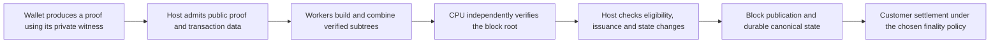

# Lattica cryptocurrency deployment review: CISO and CTO assessment

**Decision brief and supporting technical appendix — 2026-10-02**

**Initial deployment requirement:** at least **4 user transactions per minute**, excluding miner payouts. **Finality policy:** open; options and a recommendation for evaluation are set out below. Higher-volume expansion remains a separate investment decision.

## 1. Deployment recommendation

**Authorize a bounded feasibility and security programme; do not approve production deployment on the present evidence.** The initial transaction-rate requirement fits within the current design's nominal capacity. The unresolved question is whether the complete system can deliver that rate reliably, securely and economically.

The existing candidate permits 64 total transactions per nominal 12-minute transaction cycle. Assuming four issuance transactions for miner payouts, it leaves 60 user transactions: a theoretical ceiling of **5 user transactions/minute**. Delivering four would consume 80% of that nominal user capacity. Faster GPUs or more proof workers can help produce blocks on time, but cannot increase this protocol ceiling.

Current evidence demonstrates working recursive proofs, independent CPU verification and portions of local worker recovery. It does **not** demonstrate sustained deployment throughput, full transaction-type coverage, complete block-finalization deadlines or complete-tree security qualification. The new recursive block path remains **candidate/inactive**. Audit evidence for the frozen CPU artifact does not extend automatically to this path or to a distributed worker service.

| Decision area | Assessment for initial deployment | Required decision or evidence |
|---|---|---|
| Capacity for 4 user transactions/minute | Fits the nominal design under the four-issuance assumption | Confirm actual payout overhead and demonstrate useful throughput under real arrivals |
| Proof-production performance | Not qualified | Meet full-block and complete post-seal deadlines, including failure/recovery costs |
| Security and monetary integrity | New block path requires further qualification | Review recursive security, all transaction types, issuance rules and host state transitions |
| Customer finality | Undecided | Select confirmation/settlement policy and disclose its assumptions before launch |
| Availability and resilience | Local components exist; production service not demonstrated | Qualify admission, quotas, worker loss, coordinator recovery and backlog drainage |
| Commercial operating cost | Not established | Measure total cost and energy per accepted user transaction at the required service level |

This recommendation follows the [current audit status](audit-readiness-status.md) and [block-v2 release gates](block-proving-v2.md). It does not require adopting the proposed higher-capacity profiles to meet the initial four-per-minute requirement.

## 2. What the throughput requirement means

For initial qualification, count **valid, unique user transactions durably applied to the canonical host-chain state per wall-clock minute**, as a sustained average over the full declared test window, including outages and recovery. Report short-window rates and the longest gaps separately. Exclude miner payouts, duplicate submissions, invalid transactions, failed attempts and abandoned candidates. Record transactions later reversed by a reorganization separately. Once finality is selected, also report the rate of transactions reaching the chosen settlement threshold.

Four user transactions/minute equals approximately **0.067 TPS**, **240/hour**, or **5,760/day** if sustained continuously. The requirement concerns delivered transactions, not submitted requests, generated proofs, GPU operations or transactions merely admitted to a queue.

| Profile or proposal | Capacity and nominal transaction cadence | Cadence-only user ceiling | Intended service milestone | Status |
|---|---|---:|---:|---|
| Existing recursive candidate | 64 total / 12 minutes | 5/min, assuming four issuance transactions | **Initial deployment: at least 4 user/min** | Capacity arithmetic fits; performance/security gates remain open |
| First expansion proposal | 512 total / 3 minutes | 169.3/min with four reserved issuance slots | 100 user/min, about 1.7 TPS | Research proposal |
| Second expansion proposal | 4,096 total / 3 minutes | 1,364/min with four reserved issuance slots | 1,000 user/min, about 16.7 TPS | Research proposal |

The expansion proposals come from the [high-throughput plan](high-throughput-proving-plan.md). Their four issuance slots are a sizing reservation, not an approved payout policy. They require new proof profiles, security analysis, encodings and host-chain decisions. Neither is necessary merely to raise the current nominal ceiling above four user transactions/minute, and neither is demonstrated production throughput.

### Headroom and customer experience

At the initial rate, a nominal 12-minute cycle brings **48 user transactions**. Adding four issuance transactions gives 52 of the 64 available slots, leaving **12 slots** of nominal headroom. That is 20% spare user capacity, not a large resilience margin.

For illustration, missing one nominal cycle adds 48 user transactions to the backlog. If arrivals continue at four/minute and later cycles deliver the full five/minute user ceiling, draining that backlog takes four further cycles, approximately **48 minutes**, after service resumes. This assumes nominal cadence, unchanged issuance and no further losses; actual PoW timing and proof delays can make recovery longer.

Accordingly, deployment tests must cover bursts, missed cycles and recovery, not just an average rate of four on an empty queue. The acceptance report must show bounded backlog, transaction-age distributions and a declared recovery objective. A numerical recovery SLO remains a product/operations decision.

The proposed host design has nominal 90-second PoW headers and one transaction-bearing block every eighth slot. These are stochastic arrival targets, not a clockwork 12-minute inclusion guarantee. Proof preparation that delays a valid mining template can further affect realized cadence. Finality is a separate property from both inclusion and proving speed.

## 3. How Lattica would deliver a transaction

Lattica supplies a proof system; a deployable cryptocurrency additionally needs host-chain consensus, transaction selection, durable state application, networking, wallet operations and economic policy.

Workers wrap individual or paired wallet proofs, combine completed subtrees, and produce one final recursive proof. They can reuse compatible completed work as transactions arrive. Independent branches can proceed in parallel; a parent merge still depends on its children. The last few merges form a sequential path that cannot be eliminated by recruiting more workers.

Wallet spending witnesses and producer issuance witnesses remain in their wallet components. Aggregation receives public proofs and bound statements. This limits what workers need to see, but does not establish complete customer anonymity: network and operational metadata still require an explicit privacy assessment.

A valid root proof is necessary but insufficient for accepting a block. The host must bind it to the expected ordered transactions and approved profile, enforce current state and issuance rules, and apply changes atomically. The proof worker does not acquire authority over consensus or monetary policy.

## 4. Evidence relevant to the deployment decision

The following observations are recorded results, not forecasts for the proposed hardware. Timing boundaries and qualification limits are material to the decision.

| Evidence | Recorded result | Executive implication |
|---|---|---|
| [Compact opening full-workload continuation](evidence/block-v2-gpu-opening-compact-recursive-2026-10-02.json) | One eight-wallet/seven-proof run: **606.828 s** proving commands, **609.075 s** complete controller; root independently CPU-verified after local pruning; **246.800 GB** recorded host/device traffic | Compact opening correctness now extends to the full-size subtree. Historical timings are not same-build matched controls; no performance promotion, full64 or complete post-seal claim |
| [Eight-wallet GPU comparison](evidence/block-v2-gpu-openings-matched-pilot-2026-10-02.json) | Retained hashing: **607.112 s**; resident commitments plus GPU openings: **686.046 s**, **13.002% longer** in one pair | More GPU offload did not improve this workload. It is a subtree experiment, not a transaction-rate or full-block qualification |
| Same comparison, data movement | **195.562 GB → 454.669 GB**, **2.325×** recorded host/device traffic; roughly 38 GiB worker RAM | Data movement and resource demand must be addressed before extrapolating GPU purchases into capacity |
| [Controlled arrival/reuse trial](evidence/block-v2-cpu-arrivals-2026-10-02.json) | A level-six root with three selected transactions took **2,004.169 s (33.403 min)** after sealing, excluding complete host finalization | The recorded incremental path misses the existing 180-second finalization objective; a fast last merge alone is not sufficient |
| [Preprocessing reuse demonstration](evidence/block-v2-cached-cpu-2026-10-02.json) | Setup fell from **45.980 s to 0.108 s** across two different-input proofs | Reuse functions correctly; this was not a matched end-to-end speedup measurement |
| [Later matched cache-workload pilot](evidence/block-v2-cache-bench-pilot-2026-10-02.json) | Idle-cleared **562.650 s**, retained **601.444 s** through cleanup; retained **6.895% slower** in one ordered pair | No performance promotion. The first retained-arm proof was a slow cache miss; this does not isolate a causal cache regression. The control was not process/OS-cache cold |
| [Historical GPU retention comparison](evidence/block-v2-retention-matched-2026-10-01.json) | Five matched pairs on an earlier four-wallet profile: median **19.627 → 17.642 min**, **10.114% lower** | Evidence that targeted optimization can help; this result does not qualify full-block deadlines or the later CPU-cache workload |
| [Pinned GPU upload component comparison](evidence/block-v2-gpu-opening-pinned-2026-10-02.json) | Five alternating pairs: median **0.959514 s pageable / 0.971697 s pinned**, **1.270% higher** | Pinned staging did not improve this component. Component trials cannot substitute for repeated block-level comparisons |

The current proof size of **1,683,948 bytes** fits the 2 MiB root target in these samples. It is not the complete block size: public transaction data, ciphertexts, transport and storage are additional. Nor does this size establish the proof envelope for a larger-capacity profile.

Independent CPU replay and mutation rejection are useful implementation evidence. They are not an independent security audit or a demonstration that the complete cryptocurrency service meets its performance commitments.

### Subsequent GPU-default and thread-count benchmark (2026-10-02)

The [completed RAM-scratch comparison](evidence/block-v2-gpu-default-ram-bench-2026-10-02.json) contains three trials per configuration on the Core Ultra 9 275HX and RTX 5080 laptop. All twelve roots passed independent CPU verification, and all four fresh key registrations matched CPU references. Each run proves the same eight-wallet subtree using four wrappers and three merges; these are not full-block or delivered-transaction throughput measurements.

| Configuration | Median proving time | Median average logical CPU equivalents |
|---|---:|---:|
| New default-GPU build, 8 threads | 418.375 s | 3.20 |
| New default-GPU build, 16 threads | 386.375 s | 5.20 |
| New default-GPU build, 24 threads | 377.197 s | 7.13 |
| Preserved explicit-GPU control, 16 threads | 385.982 s | 5.24 |

Enabling `default = ["gpu"]` selected the same effective GPU features and dependencies as the prior explicit-GPU build. The new 16-thread median was **0.102% longer** than its contemporaneous control, providing no demonstrated speedup from the default change. The 24-thread configuration had the lowest observed median, **2.375% shorter** than the new 16-thread configuration. Three trials per arm remain exploratory and do not meet the five-pair performance-promotion requirement above.

Peak worker memory was **38.12 GiB**, including charged RAM-backed scratch, whose peak mapped allocation was **29.496 GiB**. No swap was used; sampled memory high/max/OOM counters stayed at zero. CPU equivalents divide worker CPU-seconds by stage wall-seconds on this hybrid 8-P-core/16-E-core processor; they do not establish DRAM saturation or predict Threadripper scaling. Proving times exclude registration and the independent root audit. The raw local manifests and binary/source hashes are identified in the evidence record; generated binaries and bulk run artifacts remain outside Git.

## 5. CTO assessment: what must become faster

### Separate capacity, latency and service throughput

Three different limits govern deployment:

1. **Protocol capacity:** how many user transactions fit after issuance and at what cadence. The initial four-per-minute requirement fits the existing nominal ceiling.
2. **Proof critical path:** whether the remaining dependent work finishes before the block deadline. More workers cannot remove sequential upper merges.
3. **Useful service capacity:** whether wallet proving, admission, aggregation, verification, networking and state storage collectively keep up without growing queues.

The existing candidate's reference gates are at most **600 s cold aggregation**, at most **180 s complete post-seal finalization**, and aggregate **48 GiB RAM / 12 GiB VRAM / 128 GiB scratch**, with all required transaction types covered. A fleet experiment with larger resources does not satisfy this reference gate; changing an approved release budget requires an explicit architecture decision.

### Memory and GPU conclusions

Current full-sized proof work uses roughly **38–40 GiB** of worker memory. This creates a capacity constraint and generally permits only one such stage under the 48 GiB aggregate envelope. It does not establish DRAM bandwidth saturation. File-backed spill mappings can generate page faults and storage I/O even when swap use is zero.

GPU acceleration now includes hashing, transforms, commitments and optional opening reductions. It is inaccurate to describe the candidate as GPU hashing only. Nevertheless, CPU work, host matrix materialization, transfers and protocol barriers remain.

A newer [opening diagnostic](evidence/block-v2-gpu-opening-profile-2026-10-02.json) recorded approximately **1.179 s** for an isolated opening call, **1.025 s** of upload API spans and **0.003918 s** of kernel execution. The intervals overlap and are not additive. This supports investigating that component's transfer path; it does not quantify whole-block GPU or DRAM utilization.

The practical priorities are to reduce repeated matrix movement, reuse preprocessing where matched workloads show a benefit, avoid redundant proof jobs and preserve work before sealing. Purchase decisions should follow those measurements. Advertised GPU FLOPS, AI TOPS, total VRAM or theoretical memory bandwidth do not provide a defensible transactions-per-minute estimate.

### A parallel pool improves throughput more readily than final latency

For a root with total proof-job work `W`, longest dependent path `C` and `p` equivalent worker slots, even ideal execution takes at least `max(W/p, C)`. Real transfers, queueing, failures and host finalization add costs.

An illustrative equal-cost model makes the limit concrete. With paired wrappers and each proof job taking `t`:

| Equivalent workers | Eight-wallet subtree | Fully populated 64-leaf tree |
|---:|---:|---:|
| 1 | 7t | 63t |
| 2 | 4t | 32t |
| 4 | 3t | 17t |
| 8 | 3t | 10t |
| 32 | 3t | 6t |

The eight-wallet case excludes padding to the final level-six root. Both columns assume compatible warm workers, sufficient separately declared resources and zero failures/communication overhead. They are scheduling models, not measured deployment performance.

The most valuable scheduling outcome is to finish eligible lower subtrees before seal, leaving a short path for fast, reliable workers. If three remaining merges each took the observed **71.812 s** final-merge time, that illustrative chain alone would require **215.436 s**. No fleet size fixes that particular chain without faster stages or more work completed earlier.

## 6. CISO assessment: assurance required before launch

The reviewed artifact identified by current audit documentation is the frozen `v3-batch-audit` CPU baseline. Later recursive profiles, GPU paths, worker services and host integration have their own assurance obligations. The marketing claims made for a cryptocurrency must match the exact deployed artifact and threat model.

| Risk area | Why it matters to a cryptocurrency offering | Required evidence and accountable function |
|---|---|---|
| Proof validity and monetary integrity | A defect could permit invalid state changes or unauthorized issuance | **CISO/security engineering:** independent complete-tree soundness and implementation review; **host engineering:** rejection tests for double spends, stale anchors, invalid amounts and unauthorized issuance |
| Privacy and cryptographic assumptions | Correct verification does not establish zero knowledge or an end-to-end post-quantum claim | **Cryptography/security:** review hiding randomness, composition, transcripts and assumptions for the entire deployed tree; entropy failures fail closed |
| Host-chain correctness | A valid proof can still be attached to the wrong candidate or applied against ineligible state | **CTO/host engineering:** expected-statement/profile binding, atomic mixed-transaction application, durable recovery and reorganization tests |
| Untrusted or dishonest workers | Workers may return invalid, stale, duplicate or withheld results, or misstate their capacity | **Platform/security:** bounded inputs, independent CPU verification, fenced attempts, measured capabilities and durable acceptance before credit |
| Resource exhaustion and availability | Expensive valid inputs, malformed inputs or abandoned work can consume scarce RAM, GPU time and scratch | **Platform/security:** admission limits, OS/device enforcement, physical scratch controls, cancellation/OOM tests and bounded recovery; accounting reservations alone are insufficient |
| Pool and coordinator concentration | A dominant pool or coordinator can delay or censor service even if it cannot forge valid proofs | **Architecture/operations:** documented selection policy, availability assumptions, failover and independently qualified capacity; measure degraded service |
| Worker payment and treasury exposure | Proof validity neither guarantees payment nor proves who performed the computation | **Finance/platform/security:** quoted job terms, idempotent credit, duplicate/stale policies and controlled settlement; trustless payment remains a separate project |
| Release and supply-chain integrity | Benchmark binaries, audited code and production defaults can diverge | **Release/security:** pinned sources and dependencies, reproducible artifacts, approved profile registry, explicit activation and recovery procedures |

All required transaction classes must be covered before activation: user transfers, HTLC redeem/refund and issuance. No deadline recovery path may accept an unverified proof, revive a stale candidate or silently weaken proof parameters.

Higher-capacity or shorter-cadence expansion needs fresh security and economic review. In particular, increasing state-change frequency affects anchors, HTLC heights, reorganizations and recovery. Changing transaction cadence must not accidentally pay the old 12-minute issuance amount every three minutes. Faster proof production does not authorize a change to monetary policy.

## 7. Hardware and paid-worker strategy

### Procurement should buy evidence before scale

The proposed builds are engineering candidates, not systems certified to deliver four user transactions/minute. Existing evidence was collected on a different host, including constrained eight-thread CPU runs; it cannot assign either proposed build a production rating.

| Option | Appropriate first role | Material limitation or decision |
|---|---|---|
| **9950X3D2 + one desktop RTX 5080** | Investigate single-proof latency and upper merges | 16 Zen 5 cores and 192 MB L3 may help CPU phases, but two-channel memory and host/device movement remain; no demonstrated Lattica benefit from the X3D premium |
| **5995WX + one desktop RTX 5080** | Reuse the existing 256 GB RDIMMs; investigate concurrent CPU work and one GPU worker | 64 Zen 3 cores and eight memory channels favor capacity/throughput experiments; one device and serial dependencies can still dominate |
| **5995WX + two/four Intel Arc cards** | Multi-device and independent-subtree research after a single-card qualification | Requires per-device scheduling, Intel-compatible telemetry and measured host/PCIe contention before scaling |
| **9950X3D2 + multiple Arc cards** | Small two-device development experiment | AM5 slot routing, CPU lanes and shared memory bandwidth make a four-card purchase difficult to justify without measurements |
| **Heterogeneous paid worker pool** | Add qualified early-subtree capacity; keep final stages on stable measured-fast workers | Availability, service-time variance, verification, incentives and coordinator capacity determine useful throughput |

AMD specifies the 9950X3D2 at 16 cores/32 threads with 192 MB L3; it requires DDR5 UDIMMs and cannot reuse the existing DDR4 RDIMMs. Its rated two-channel DDR5-5600 peak is **89.6 GB/s**. AMD's four-DIMM DDR5-3600 rating corresponds to **57.6 GB/s**, so a high-capacity AM5 build must not assume two-DIMM memory speeds.

The 5995WX supports an eight-channel DDR4 workstation configuration. Existing eight DDR4-2400 RDIMMs provide **153.6 GB/s** theoretical payload bandwidth; DDR4-3200 would provide **204.8 GB/s**. Exact DIMMs, BIOS, slots and channel population require board validation. These ratios do not predict application speedups.

Representative Arc options are **A770 16 GB**, **B580 12 GB**, **Arc Pro B60 24 GB** and **B70 32 GB**. Four cards provide separate memory spaces; their VRAM is not automatically pooled for one proof. The 16 GB desktop RTX 5080 is the NVIDIA comparison, distinct from the laptop's mobile GPU. The current engine's exclusive per-user GPU lease prevents automatic concurrent multi-card execution.

**Recommended purchase sequence:** qualify one host and one GPU; measure whole-host service cost; qualify a second device or host; expand only after useful throughput and deadline results justify it. The initial four-per-minute requirement alone does not justify a large Arc array or an open worker marketplace.

### Stratum-style incentives do not produce Stratum-style scaling

A service can borrow authenticated sessions, job assignments, heartbeats, deadlines and payment accounting from mining pools. Proof jobs depend on specific inputs and child proofs, so independent hash-search scaling does not apply. The existing local supervisor is not an implemented internet pool or payment service.

Assign complete contiguous subtrees to workers. Keep intermediate matrices local and exchange pinned public inputs and root proofs. Under the current compact proof size, two child proofs plus one result total **5,051,844 bytes**: about **0.404 s at 100 Mbit/s** before latency, protocol overhead and verification. This can be modest beside current proof times; shipping hundreds of GiB of internal matrices over WAN would be a different proposition.

Pay for an accepted logical job under published terms, not self-reported effort, GPU seconds or artificial shares. Independent verification, duplicate suppression and candidate/attempt fencing are necessary. Cancellation and speculative-retry compensation must be explicit, since unpaid interrupted work raises worker prices and encourages churn.

A proof establishes a statement, not hardware provenance or a guarantee that a coordinator will pay. Outsourcing, proof resale, escrow and disputes need an explicit commercial policy. Begin with a controlled operator-managed service before assuming permissionless settlement or an elastic pool will be reliable.

Cost the service using **total cost per accepted user transaction at the required latency**, including payouts to proof workers, CPU/GPU host energy, amortization, storage, networking, verification, failed attempts and redundant work. Measure whole-host power; CPU TDP and GPU board ratings are not an energy bill. At the initial load of 240 user transactions/hour, fixed standby and coordinator costs can be material. Protocol miner rewards and contracted proof-worker payments are separate expenses and incentives.

## 8. Finality options to evaluate

The finality requirement remains open. Proof verification shows that a block's claimed transition is valid; it does not make the block irreversible. The [host-chain design](block-production-consensus.md) leaves finality outside Lattica's audited proof-system boundary.

| Option | Customer-facing policy | Benefits and tradeoffs |
|---|---|---|
| **PoW confirmations with one settlement threshold** | Mark inclusion as pending; settle after a specified number of additional canonical headers | Closest to the current host design. Reorganization risk remains probabilistic; the threshold needs an attacker/hash-power and economic-risk assessment |
| **Risk-tiered PoW acceptance** | Use pending/limited acceptance for low-risk activity and a stronger threshold for withdrawals, high-value transfers or irreversible delivery | Can improve perceived responsiveness without changing consensus. The business explicitly bears risk before the stronger threshold; it must not label early acceptance as irreversible finality |
| **Reviewed checkpoint/finality mechanism** | Settle when a separately specified checkpoint or BFT quorum finalizes the block | Can provide stronger finality under its stated validator/quorum/network assumptions. Adds trust, governance, key-management and liveness obligations; it is not currently an implemented assurance |

**Recommendation for evaluation:** start with a PoW confirmation policy and clear pending-versus-settled states. Introduce risk tiers only where business exposure can be bounded. If irreversible settlement within a firm wall-clock deadline is essential, evaluate a checkpoint mechanism as a separate reviewed protocol project rather than promising it from the current design.

For illustration only, at the nominal 90-second header interval, **2, 6 or 12 additional headers** correspond to mean waits of approximately **3, 9 or 18 minutes after inclusion**. These are neither safe confirmation-count recommendations nor time guarantees. Wallet proving, admission, waiting for a transaction-bearing block and proof/publication delays precede that point. Real hash-power distribution, propagation, reorganizations and incentives must inform the policy.

Before launch, product leadership, the host-chain architect and the CISO must approve what the service calls “accepted,” “confirmed” and “settled,” the applicable risk threshold, and treatment of reorganized transactions. Finality may remain open during feasibility work, but not in a customer settlement promise.

## 9. Investment stages and deployment gates

| Gate | Required evidence | Decision owner |
|---|---|---|
| **G0 — Product service definition** | Fix the four-user/minute metric, payout overhead, burst/backlog-recovery objectives, cost ceiling and finality policy. Keep 100/1,000-per-minute growth goals separate | Product, CTO, CISO and finance |
| **G1 — Existing candidate feasibility** | Full transaction coverage; 64-transaction cold and complete post-seal gates; independent CPU root verification; declared aggregate resource limits. No substitution of a small subtree or the last merge alone | Prover and host engineering, reviewed by CTO |
| **G2 — Measured initial service** | Sustain at least four useful user transactions/minute under real arrivals, including issuance and mixed transaction types, with bounded queues and complete host processing | Platform/host engineering and operations |
| **G3 — Security and recovery** | Independent complete-tree review, exact release scope, monetary/state invariants, malicious/slow workers, cancellation/OOM, coordinator loss, durable recovery and reorganizations | CISO and independent reviewers |
| **G4 — Economics and operational readiness** | Cost/energy per accepted user transaction, standby/retry costs, capacity headroom, monitoring, recovery runbooks, worker payment controls and approved customer finality language | CTO, operations, finance and CISO |
| **G5 — Explicit activation** | Approved version/profile identities, compatibility and activation plan, operational rollback/recovery policy, and all prior evidence attached to the actual release artifact | Host-chain governance and release owners |

For sustained qualification, use **at least 24 hours and 100 complete root cycles, whichever is longer**, after separately reported warm-up. Include cold starts, bursts, missed deadlines and declared failure scenarios. Report actual user transactions, issuance, deferrals, failures and reorganizations separately. Show queue age and p50/p95/p99 inclusion and complete post-seal latency; small-sample tail estimates do not establish a production guarantee.

Backend and hardware comparisons require at least **five alternating matched pairs**, the same public inputs/profile, independently verified outputs, fixed timing boundaries and declared resource budgets. More samples or longer tests are required when variability or failure rates prevent a defensible conclusion.

The next funded work should be: establish the four-per-minute mixed-workload benchmark; measure full pipeline service demand; reduce unnecessary transfer/materialization and prove useful cache reuse; then compare the proposed CPU/GPU platforms. Expand the fleet only when per-worker capacity, critical-path latency and total cost justify it. If a gate cannot be met, revise the implementation, budget or requirement through an explicit decision; do not lower cryptographic assurance to recover a deadline.

## Appendix A — Engineering facts supporting the assessment

### Source snapshot and interpretation

This assessment uses the inspected working tree at HEAD `eda5ee1b4a750ea58774acdb22271daafdbdd389` and evidence dated through 2026-10-02, including newer cache and opening-upload investigations. The candidate `src/block_v2/` tree inside the prover and `docs/evidence/` were untracked alongside other working changes; HEAD alone does not reproduce the inspected implementation. Each experiment's preserved source, binary and fixture pins control its scope.

No new proof benchmarks or independent security audit were performed for this rewrite. Older roadmap descriptions of missing GPU or local execution features must be checked against current code; normative profile and release requirements still control. [Documentation authority rules](README.md#authority-rules) and [audit status](audit-readiness-status.md) define those boundaries.

### Pipeline and resource details

The [recursive construction](../lattica-prover-p3/src/block_v2/recursive.rs) compiles wrappers, empties and merges into a bounded execution AIR. The [machine backend](../lattica-prover-p3/src/block_v2/machine/backend.rs) generates execution traces and invokes Plonky3 proving. The [candidate profile](../lattica-prover-p3/src/block_v2/profile.rs) uses Goldilocks arithmetic with a cubic extension, blowup 16, 128 queries, cap height 6, four random codewords and 16 query proof-of-work bits. These exact finite-field operations are not AI tensor workloads.

The authoritative candidate gate requires at least the project's **100-bit proven-soundness objective for the complete tree** under recorded assumptions. Per-proof estimates do not establish that bound or an end-to-end post-quantum certification. The CISO must approve the security objective and its applicability to the offering as part of the release review.

The compact [geometry record](evidence/block-v2-fixed-node-codec-2026-10-01.json) has common height **262,144**, main width **94**, paired-wrapper active rows **160,893**, merge active rows **258,973**, and only **384** active rows for an empty program. Required padding means an empty proof can still be expensive. The **29.5 GiB** retained-LDE estimate excludes other allocations and is not a measured total RAM/VRAM peak.

The [cached CPU adapter](../lattica-prover-p3/src/block_v2/execution/worker_cached.rs) is synchronous and retains one immutable program type; a mode switch evicts it. Its session reserves 44 GiB RAM and a job adds 1 GiB. Those are admission reservations, not physical quotas. Fresh per-proof randomness and exact registered-program checks remain necessary.

The [resident backend](../lattica-prover-p3/src/block_v2/resident_pcs.rs) still materializes host matrices. The [opening backend](../lattica-prover-p3/src/block_v2/opening_pcs.rs) moves matrix reductions to the GPU, while CPU evaluations/denominators and the upstream FRI protocol remain; configured FRI commitment hashing can still use GPU acceleration. The [GPU engine](../lattica-prover-p3/src/block_v2/gpu_hash/engine.rs) currently serializes its context and takes an exclusive per-user lease.

Record DRAM-controller bandwidth, cache/cycle counters, page faults, physical scratch I/O, PCIe bytes/link state and supported OpenCL event timings separately. Current [phase/timeline instrumentation](../lattica-prover-p3/src/block_v2/perf/timeline.rs) does not establish DRAM saturation. Nested CPU spans and GPU events can overlap and must not be summed into elapsed-time percentages. Sampled VRAM peaks are not instantaneous enforcement guarantees.

### Hardware references and limits

[AMD's 9950X3D2 specifications](https://www.amd.com/en/products/processors/desktops/ryzen/9000-series/amd-ryzen-9-9950x3d2-dual-edition.html), [Lenovo's P620/5995WX platform reference](https://psref.lenovo.com/syspool/Sys/PDF/ThinkStation/ThinkStation_P620/ThinkStation_P620_Spec.pdf) and [NVIDIA's desktop RTX 5080 specifications](https://www.nvidia.com/en-us/geforce/graphics-cards/50-series/rtx-5080/) support the hardware descriptions. Arc capacities use the [Intel Arc model tables](https://en.wikipedia.org/wiki/Intel_Arc), a secondary reference because Intel's direct specification pages returned access errors during the prior review. Confirm exact purchased cards and drivers before qualification.

The 9950X3D2's cache is 192 MB L3 plus 16 MB L2, not 208 MB L3. The 5995WX has 256 MB aggregate L3 across chiplets. Neither cache total can hold a 29.5 GiB matrix working set. The current [compiler target](../lattica-prover-p3/.cargo/config.toml) is `x86-64-v3`; native/AVX-512 comparisons require separate build and correctness controls.

Arc A770 16 GB uses a Gen4 x16 interface; B580 uses Gen4 x8; Pro B60 uses Gen5 x8; Pro B70 and desktop RTX 5080 use Gen5 x16. On a Gen4 host, Gen5 cards negotiate the available generation. Check actual slot width, chipset sharing, Above-4G/ReBAR settings, cooling and whole-host power. Mining-style x1 risers are a poor default for this transfer-heavy workload.

The proposed EPYC 7763 with the same eight DDR4-2400 RDIMMs remains an alternative capacity-oriented host with 153.6 GB/s theoretical memory bandwidth. None of the EPYC, 9950X3D2, 5995WX or Arc proposals has a measured Lattica production rating. Repository GPU records identify “NVIDIA GeForce RTX 5080,” while the user describes a mobile 5080; preserve actual run metadata rather than equating those configurations.

## Appendix B — Calculation and measurement conventions

- Initial user ceiling: `(64 total - 4 issuance) / 12 minutes = 5 user/min`. Initial demand: `4 * 12 = 48 users/cycle`; remaining user capacity: `60 - 48 = 12`, or 20%.
- Future cadence-only ceilings: `(512 - 4) / 3 = 169.3 user/min`; `(4096 - 4) / 3 = 1364 user/min`. These assume payout reservations and nominal cadence, not demonstrated delivery.
- Memory peaks use GiB/MiB; bandwidth and transfer totals labeled GB use decimal units. The GPU comparison's exact total traffic is **195,561,873,152** versus **454,669,291,872** bytes: 182.131 versus 423.444 GiB. Its ratio is 2.325×, not a CPU-memory-bandwidth measurement.
- The ideal worker table uses level populations `[4, 2, 1]` and `[32, 16, 8, 4, 2, 1]`, summing `ceil(jobs_at_level / workers) * t`. Unequal stage times, cache changes and constrained resources require an actual schedule.
- Fleet sizing starts with measured service demand: `worker slots >= user_tx_per_min * worker_seconds_per_user_tx / (60 * useful_utilization)`. Attribute issuance, padding, verification, retries and fixed per-block work to the demand; also satisfy memory/device limits and the sequential deadline.
- A useful worker-capacity model is `(3600 / mean_attempt_seconds) * available_fraction * valid_fraction * (1 - stale_or_duplicate_fraction)`. Self-reported compute and accepted job counts of different costs are not interchangeable capacity measures.
- Cost and energy denominators use accepted user transactions and, once defined, settled user transactions. Root throughput across independent candidates is not automatically single-chain confirmed throughput.

Engineering follow-up should use the [distributed-proving roadmap](distributed-proving.md), [DAG/GPU implementation plan](dag-gpu-implementation.md) and [throughput engineering plan](high-throughput-proving-plan.md). This brief changes no proof parameters, protocol limits, backend defaults, payment mechanism or activation status.
